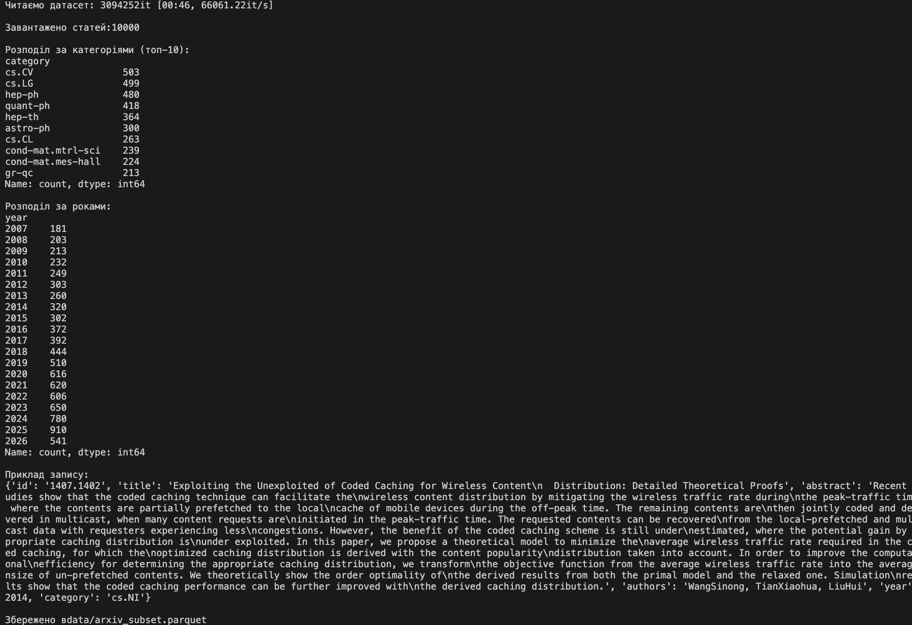
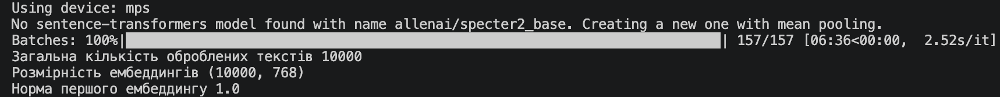
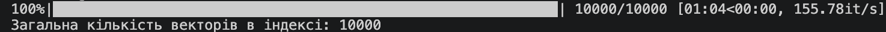
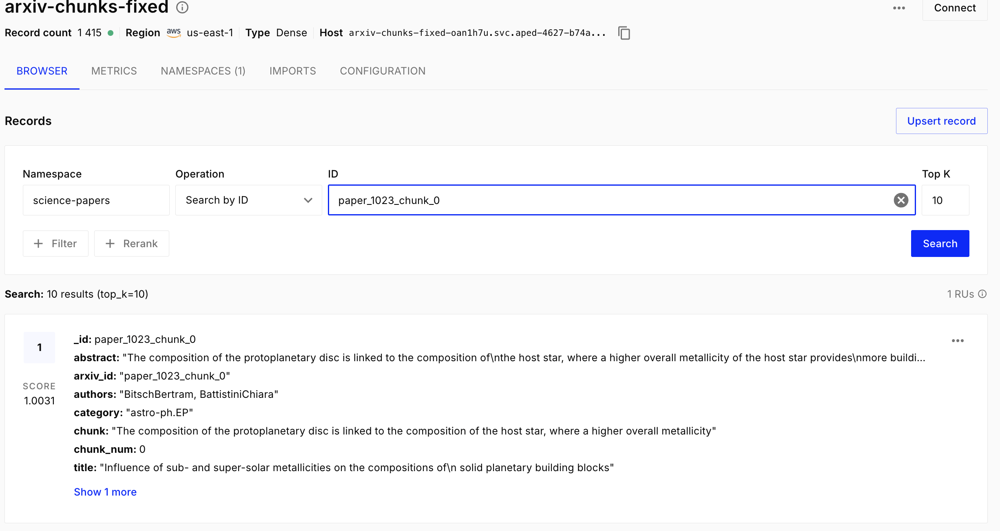
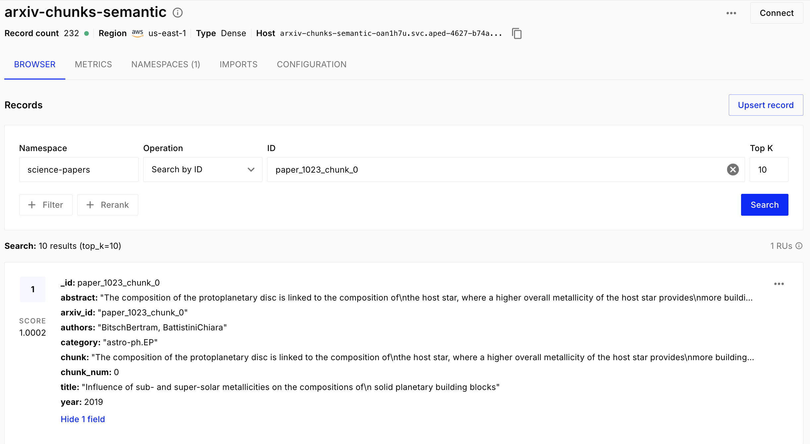
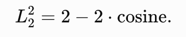

# Zazhytskyi_nosql_2

## Частина 1 — Підготовка даних і вибір інструментів

###  1.1. Завантаження і підготовка датасету



### 1.2. Вибір інструментів

1. Pinecone використовує Serverless-архітектуру як основний спосіб розгортання, на відміну від self-hosted і
вбудованої бібліотеки у випадку Qdrant і Chroma відповідно.
Pinecone є комерційним (proprietary, closed-source) продуктом, сервіс надається як DBaaS (Database as a Service),
самостійно розгорнути Pinecone на власному сервері не можна (виняток — спеціальна пропозиція BYOC для великих корпоративних клієнтів, де сервіс працює у вашому хмарному акаунті). Існують тарифні плани.
Продуктивність Pinecone аналогічна Qdrant і краща ніж в Chroma.
Pinecone обирати коли: хочете зосередитися на бізнес-логіці, а не на DevOps, потрібен швидкий MVP або proof-of-concept, команда невелика, немає виділеного інфраструктурного інженера.
Qdrant обирати коли: дані не можуть покидати вашу інфраструктуру (compliance, безпека), потрібен гібридний пошук з коробки, важлива продуктивність при складних фільтрах за метаданими.
Chroma обирати коли: потрібний швидкісий старт, прототипи, експерименти, локальні RAG-пайплайни.

2. Для задачі пошуку по науковим текстам обрана модель specter2_base тому що модель specter2_base
натренована на наукових текстах.
Model Description
SPECTER2 has been trained on over 6M triplets of scientific paper citations, which are available here. Post that it is trained with additionally attached task format specific adapter modules on all the SciRepEval training tasks.
Task Formats trained on:
Classification
Regression
Proximity (Retrieval)
Adhoc Search
It builds on the work done in SciRepEval: A Multi-Format Benchmark for Scientific Document Representations and we evaluate the trained model on this benchmark as well.

3. У Model Card для allenai/specter2_base не вказано явної рекомендації щодо метрики схожості.
Метрика схожості важлива при створенні індексу. Під час створення векторного індексу необхідно заздалегідь вибрати метрику відстані, оскільки саме вона визначає, як система буде шукати найближчі вектори.


### 1.3. Отримання ембеддингів



Тому що для нормалізованих векторів скалярний добуткок (dot product) чисельно дорівнює косинусній схожості.
Тобто при нормалізації довжина векторів стає одиничною, тому знаменник в формулі косинусної схожості стає
рівним 1, у результаті косинусна схожість і скалярний добуток мають одакове значення. 

## Частина 2 — Завантаження даних і метадані




## Частина 3 — Пошукові запити

```
Чистий семантичний пошук, результати:

title: Artificial Intelligence Generated Coins for Size Comparison
category: cs.CV
year: 2023.0
abstract: Authors of scientific articles use coins in photographs as a size reference
for objects. For this purpose, coins are placed next to objects when taking the
photo. In this letter we propose a novel method that uses artificial
intelligence (AI) generated images of coins to provide a size reference in
photos. The newest generation is able to quickly generate realistic
high-quality images from textual descriptions. With the proposed method no
physical coin is required while taking photos. Coins can 
------------------------------
title: Searching for Uncollected Litter with Computer Vision
category: cs.CV
year: 2022.0
abstract: This study combines photo metadata and computer vision to quantify where
uncollected litter is present. Images from the Trash Annotations in Context
(TACO) dataset were used to teach an algorithm to detect 10 categories of
garbage. Although it worked well with smartphone photos, it struggled when
trying to process images from vehicle mounted cameras. However, increasing the
variety of perspectives and backgrounds in the dataset will help it improve in
unfamiliar situations. These data are plotte
------------------------------
title: Memory and attention in deep learning
category: cs.LG
year: 2021.0
abstract: Intelligence necessitates memory. Without memory, humans fail to perform
various nontrivial tasks such as reading novels, playing games or solving
maths. As the ultimate goal of machine learning is to derive intelligent
systems that learn and act automatically just like human, memory construction
for machine is inevitable. Artificial neural networks model neurons and
synapses in the brain by interconnecting computational units via weights, which
is a typical class of machine learning algorithms 
------------------------------
title: Exploration and Exploitation in Visuomotor Prediction of Autonomous
  Agents
category: cs.LG
year: 2013.0
abstract: This paper discusses various techniques to let an agent learn how to predict
the effects of its own actions on its sensor data autonomously, and their
usefulness to apply them to visual sensors. An Extreme Learning Machine is used
for visuomotor prediction, while various autonomous control techniques that can
aid the prediction process by balancing exploration and exploitation are
discussed and tested in a simple system: a camera moving over a 2D greyscale
image.
------------------------------
title: Enhancing Pollinator Conservation towards Agriculture 4.0: Monitoring of
  Bees through Object Recognition
category: cs.CV
year: 2024.0
abstract: In an era of rapid climate change and its adverse effects on food production,
technological intervention to monitor pollinator conservation is of paramount
importance for environmental monitoring and conservation for global food
security. The survival of the human species depends on the conservation of
pollinators. This article explores the use of Computer Vision and Object
Recognition to autonomously track and report bee behaviour from images. A novel
dataset of 9664 images containing bees is e
------------------------------


Пошук з фільтрацією, приклад A, результати:

title: Robust In-Context Reinforcement Learning Under Reward Poisoning Attacks
category: cs.LG
year: 2025.0
abstract: We study the corruption-robustness of in-context reinforcement learning (ICRL), focusing on the Decision-Pretrained Transformer (DPT, Lee et al., 2023). To address the challenge of reward poisoning attacks targeting the DPT, we propose a novel adversarial training framework, called Adversarially Trained DPT (AT-DPT). Our method simultaneously trains a population of attackers to minimize the true reward of the DPT by poisoning environment rewards, and a DPT model to infer optimal actions from the
------------------------------
title: Agent-Centric Representations for Multi-Agent Reinforcement Learning
category: cs.LG
year: 2021.0
abstract: Object-centric representations have recently enabled significant progress in
tackling relational reasoning tasks. By building a strong object-centric
inductive bias into neural architectures, recent efforts have improved
generalization and data efficiency of machine learning algorithms for these
problems. One problem class involving relational reasoning that still remains
under-explored is multi-agent reinforcement learning (MARL). Here we
investigate whether object-centric representations are a
------------------------------
title: Reinforcement Learning with Fast and Forgetful Memory
category: cs.LG
year: 2023.0
abstract: Nearly all real world tasks are inherently partially observable,
necessitating the use of memory in Reinforcement Learning (RL). Most model-free
approaches summarize the trajectory into a latent Markov state using memory
models borrowed from Supervised Learning (SL), even though RL tends to exhibit
different training and efficiency characteristics. Addressing this discrepancy,
we introduce Fast and Forgetful Memory, an algorithm-agnostic memory model
designed specifically for RL. Our approach co
------------------------------
title: Improve Value Estimation of Q Function and Reshape Reward with Monte
  Carlo Tree Search
category: cs.LG
year: 2024.0
abstract: Reinforcement learning has achieved remarkable success in perfect information
games such as Go and Atari, enabling agents to compete at the highest levels
against human players. However, research in reinforcement learning for
imperfect information games has been relatively limited due to the more complex
game structures and randomness. Traditional methods face challenges in training
and improving performance in imperfect information games due to issues like
inaccurate Q value estimation and rewa
------------------------------
title: Task-specific Subnetwork Discovery in Reinforcement Learning for Autonomous Underwater Navigation
category: cs.LG
year: 2026.0
abstract: Autonomous underwater vehicles are required to perform multiple tasks adaptively and in an explainable manner under dynamic, uncertain conditions and limited sensing, challenges that classical controllers struggle to address. This demands robust, generalizable, and inherently interpretable control policies for reliable long-term monitoring. Reinforcement learning, particularly multi-task RL, overcomes these limitations by leveraging shared representations to enable efficient adaptation across ta
------------------------------


Пошук з фільтрацією, приклад B, результати:

title: Adaptive Bases for Reinforcement Learning
category: cs.LG
year: 2010.0
abstract: We consider the problem of reinforcement learning using function
approximation, where the approximating basis can change dynamically while
interacting with the environment. A motivation for such an approach is
maximizing the value function fitness to the problem faced. Three errors are
considered: approximation square error, Bellman residual, and projected Bellman
residual. Algorithms under the actor-critic framework are presented, and shown
to converge. The advantage of such an adaptive basis i
------------------------------
title: Many-body approach to the dynamics of batch learning
category: cond-mat.dis-nn
year: 1999.0
abstract: Using the cavity method and diagrammatic methods, we model the dynamics of
batch learning of restricted sets of examples, widely applicable to general
learning cost functions, and fully taking into account the temporal
correlations introduced by the recycling of the examples.
------------------------------
title: A mu-differentiable Lagrange multiplier rule
category: math.CA
year: 2008.0
abstract: We present some properties of the gradient of a mu-differentiable function.
The Method of Lagrange Multipliers for mu-differentiable functions is then
exemplified.
------------------------------
title: Exploration and Exploitation in Visuomotor Prediction of Autonomous
  Agents
category: cs.LG
year: 2013.0
abstract: This paper discusses various techniques to let an agent learn how to predict
the effects of its own actions on its sensor data autonomously, and their
usefulness to apply them to visual sensors. An Extreme Learning Machine is used
for visuomotor prediction, while various autonomous control techniques that can
aid the prediction process by balancing exploration and exploitation are
discussed and tested in a simple system: a camera moving over a 2D greyscale
image.
------------------------------
title: Linear and Geometric Mixtures - Analysis
category: cs.IT
year: 2013.0
abstract: Linear and geometric mixtures are two methods to combine arbitrary models in
data compression. Geometric mixtures generalize the empirically well-performing
PAQ7 mixture. Both mixture schemes rely on weight vectors, which heavily
determine their performance. Typically weight vectors are identified via Online
Gradient Descent. In this work we show that one can obtain strong code length
bounds for such a weight estimation scheme. These bounds hold for arbitrary
input sequences. For this purpose we
------------------------------

Top-5 статей для метрики cosine similarity:
score: 0.8357
title: Continual Reinforcement Learning deployed in Real-life using Policy
  Distillation and Sim2Real Transfer, abstract: We focus on the problem of teaching a robot to solve tasks presented
sequentially, i.e., in a continual learning scenario. The robot should be able
to solve all tasks it has encountered, without forgetting past tasks. We
provide preliminary work on applying Reinforcement Learning to such setting, on
2D navigation tasks for a 3 wheel omni-directional robot. Our approach takes
advantage of state representation learning and policy distillation. Policies
are trained using learned features as input, rather than raw observations,
allowing better sample efficiency. Policy distillation is used to combine
multiple policies into a single one that solves all encountered tasks.
abstract: We focus on the problem of teaching a robot to solve tasks presented
sequentially, i.e., in a continual learning scenario. The robot should be able
to solve all tasks it has encountered, without forgetting past tasks. We
provide preliminary work on applying Reinforcement Learning to such setting, on
2D navigation tasks for a 3 wheel omni-directional robot. Our approach takes
advantage of state representation learning and policy distillation. Policies
are trained using learned features as input, rather than raw observations,
allowing better sample efficiency. Policy distillation is used to combine
multiple policies into a single one that solves all encountered tasks.
------------------------------
score: 0.8276
title: UAV Trajectory Optimization via Improved Noisy Deep Q-Network, abstract: This paper proposes an Improved Noisy Deep Q-Network (Noisy DQN) to enhance the exploration and stability of Unmanned Aerial Vehicle (UAV) when applying deep reinforcement learning in simulated environments. This method enhances the exploration ability by combining the residual NoisyLinear layer with an adaptive noise scheduling mechanism, while improving training stability through smooth loss and soft target network updates. Experiments show that the proposed model achieves faster convergence and up to $+40$ higher rewards compared to standard DQN and quickly reach to the minimum number of steps required for the task 28 in the 15 * 15 grid navigation environment set up. The results show that our comprehensive improvements to the network structure of NoisyNet, exploration control, and training stability contribute to enhancing the efficiency and reliability of deep Q-learning.
abstract: This paper proposes an Improved Noisy Deep Q-Network (Noisy DQN) to enhance the exploration and stability of Unmanned Aerial Vehicle (UAV) when applying deep reinforcement learning in simulated environments. This method enhances the exploration ability by combining the residual NoisyLinear layer with an adaptive noise scheduling mechanism, while improving training stability through smooth loss and soft target network updates. Experiments show that the proposed model achieves faster convergence and up to $+40$ higher rewards compared to standard DQN and quickly reach to the minimum number of steps required for the task 28 in the 15 * 15 grid navigation environment set up. The results show that our comprehensive improvements to the network structure of NoisyNet, exploration control, and training stability contribute to enhancing the efficiency and reliability of deep Q-learning.
------------------------------
score: 0.8248
title: Robust In-Context Reinforcement Learning Under Reward Poisoning Attacks, abstract: We study the corruption-robustness of in-context reinforcement learning (ICRL), focusing on the Decision-Pretrained Transformer (DPT, Lee et al., 2023). To address the challenge of reward poisoning attacks targeting the DPT, we propose a novel adversarial training framework, called Adversarially Trained DPT (AT-DPT). Our method simultaneously trains a population of attackers to minimize the true reward of the DPT by poisoning environment rewards, and a DPT model to infer optimal actions from the poisoned data. We evaluate the effectiveness of our approach against standard bandit algorithms, including robust baselines designed to handle reward contamination. Our results show that AT-DPT significantly outperforms them in bandit settings under a learned attacker, and generalizes to more complex environments such as adaptive attackers and MDPs. It shows promise in ICRL as a meta-RL approach to learning effective corruption-robust algorithms.
abstract: We study the corruption-robustness of in-context reinforcement learning (ICRL), focusing on the Decision-Pretrained Transformer (DPT, Lee et al., 2023). To address the challenge of reward poisoning attacks targeting the DPT, we propose a novel adversarial training framework, called Adversarially Trained DPT (AT-DPT). Our method simultaneously trains a population of attackers to minimize the true reward of the DPT by poisoning environment rewards, and a DPT model to infer optimal actions from the poisoned data. We evaluate the effectiveness of our approach against standard bandit algorithms, including robust baselines designed to handle reward contamination. Our results show that AT-DPT significantly outperforms them in bandit settings under a learned attacker, and generalizes to more complex environments such as adaptive attackers and MDPs. It shows promise in ICRL as a meta-RL approach to learning effective corruption-robust algorithms.
------------------------------
score: 0.8240
title: Adaptive Bases for Reinforcement Learning, abstract: We consider the problem of reinforcement learning using function
approximation, where the approximating basis can change dynamically while
interacting with the environment. A motivation for such an approach is
maximizing the value function fitness to the problem faced. Three errors are
considered: approximation square error, Bellman residual, and projected Bellman
residual. Algorithms under the actor-critic framework are presented, and shown
to converge. The advantage of such an adaptive basis is demonstrated in
simulations.
abstract: We consider the problem of reinforcement learning using function
approximation, where the approximating basis can change dynamically while
interacting with the environment. A motivation for such an approach is
maximizing the value function fitness to the problem faced. Three errors are
considered: approximation square error, Bellman residual, and projected Bellman
residual. Algorithms under the actor-critic framework are presented, and shown
to converge. The advantage of such an adaptive basis is demonstrated in
simulations.
------------------------------
score: 0.8238
title: Agent-Centric Representations for Multi-Agent Reinforcement Learning, abstract: Object-centric representations have recently enabled significant progress in
tackling relational reasoning tasks. By building a strong object-centric
inductive bias into neural architectures, recent efforts have improved
generalization and data efficiency of machine learning algorithms for these
problems. One problem class involving relational reasoning that still remains
under-explored is multi-agent reinforcement learning (MARL). Here we
investigate whether object-centric representations are also beneficial in the
fully cooperative MARL setting. Specifically, we study two ways of
incorporating an agent-centric inductive bias into our RL algorithm: 1.
Introducing an agent-centric attention module with explicit connections across
agents 2. Adding an agent-centric unsupervised predictive objective (i.e. not
using action labels), to be used as an auxiliary loss for MARL, or as the basis
of a pre-training step. We evaluate these approaches on the Google Research
Football environment as well as DeepMind Lab 2D. Empirically, agent-centric
representation learning leads to the emergence of more complex cooperation
strategies between agents as well as enhanced sample efficiency and
generalization.
abstract: Object-centric representations have recently enabled significant progress in
tackling relational reasoning tasks. By building a strong object-centric
inductive bias into neural architectures, recent efforts have improved
generalization and data efficiency of machine learning algorithms for these
problems. One problem class involving relational reasoning that still remains
under-explored is multi-agent reinforcement learning (MARL). Here we
investigate whether object-centric representations are also beneficial in the
fully cooperative MARL setting. Specifically, we study two ways of
incorporating an agent-centric inductive bias into our RL algorithm: 1.
Introducing an agent-centric attention module with explicit connections across
agents 2. Adding an agent-centric unsupervised predictive objective (i.e. not
using action labels), to be used as an auxiliary loss for MARL, or as the basis
of a pre-training step. We evaluate these approaches on the Google Research
Football environment as well as DeepMind Lab 2D. Empirically, agent-centric
representation learning leads to the emergence of more complex cooperation
strategies between agents as well as enhanced sample efficiency and
generalization.
------------------------------

Top-5 статей для метрики dot product:
score: 0.8357
title: Continual Reinforcement Learning deployed in Real-life using Policy
  Distillation and Sim2Real Transfer, abstract: We focus on the problem of teaching a robot to solve tasks presented
sequentially, i.e., in a continual learning scenario. The robot should be able
to solve all tasks it has encountered, without forgetting past tasks. We
provide preliminary work on applying Reinforcement Learning to such setting, on
2D navigation tasks for a 3 wheel omni-directional robot. Our approach takes
advantage of state representation learning and policy distillation. Policies
are trained using learned features as input, rather than raw observations,
allowing better sample efficiency. Policy distillation is used to combine
multiple policies into a single one that solves all encountered tasks.
abstract: We focus on the problem of teaching a robot to solve tasks presented
sequentially, i.e., in a continual learning scenario. The robot should be able
to solve all tasks it has encountered, without forgetting past tasks. We
provide preliminary work on applying Reinforcement Learning to such setting, on
2D navigation tasks for a 3 wheel omni-directional robot. Our approach takes
advantage of state representation learning and policy distillation. Policies
are trained using learned features as input, rather than raw observations,
allowing better sample efficiency. Policy distillation is used to combine
multiple policies into a single one that solves all encountered tasks.
------------------------------
score: 0.8276
title: UAV Trajectory Optimization via Improved Noisy Deep Q-Network, abstract: This paper proposes an Improved Noisy Deep Q-Network (Noisy DQN) to enhance the exploration and stability of Unmanned Aerial Vehicle (UAV) when applying deep reinforcement learning in simulated environments. This method enhances the exploration ability by combining the residual NoisyLinear layer with an adaptive noise scheduling mechanism, while improving training stability through smooth loss and soft target network updates. Experiments show that the proposed model achieves faster convergence and up to $+40$ higher rewards compared to standard DQN and quickly reach to the minimum number of steps required for the task 28 in the 15 * 15 grid navigation environment set up. The results show that our comprehensive improvements to the network structure of NoisyNet, exploration control, and training stability contribute to enhancing the efficiency and reliability of deep Q-learning.
abstract: This paper proposes an Improved Noisy Deep Q-Network (Noisy DQN) to enhance the exploration and stability of Unmanned Aerial Vehicle (UAV) when applying deep reinforcement learning in simulated environments. This method enhances the exploration ability by combining the residual NoisyLinear layer with an adaptive noise scheduling mechanism, while improving training stability through smooth loss and soft target network updates. Experiments show that the proposed model achieves faster convergence and up to $+40$ higher rewards compared to standard DQN and quickly reach to the minimum number of steps required for the task 28 in the 15 * 15 grid navigation environment set up. The results show that our comprehensive improvements to the network structure of NoisyNet, exploration control, and training stability contribute to enhancing the efficiency and reliability of deep Q-learning.
------------------------------
score: 0.8248
title: Robust In-Context Reinforcement Learning Under Reward Poisoning Attacks, abstract: We study the corruption-robustness of in-context reinforcement learning (ICRL), focusing on the Decision-Pretrained Transformer (DPT, Lee et al., 2023). To address the challenge of reward poisoning attacks targeting the DPT, we propose a novel adversarial training framework, called Adversarially Trained DPT (AT-DPT). Our method simultaneously trains a population of attackers to minimize the true reward of the DPT by poisoning environment rewards, and a DPT model to infer optimal actions from the poisoned data. We evaluate the effectiveness of our approach against standard bandit algorithms, including robust baselines designed to handle reward contamination. Our results show that AT-DPT significantly outperforms them in bandit settings under a learned attacker, and generalizes to more complex environments such as adaptive attackers and MDPs. It shows promise in ICRL as a meta-RL approach to learning effective corruption-robust algorithms.
abstract: We study the corruption-robustness of in-context reinforcement learning (ICRL), focusing on the Decision-Pretrained Transformer (DPT, Lee et al., 2023). To address the challenge of reward poisoning attacks targeting the DPT, we propose a novel adversarial training framework, called Adversarially Trained DPT (AT-DPT). Our method simultaneously trains a population of attackers to minimize the true reward of the DPT by poisoning environment rewards, and a DPT model to infer optimal actions from the poisoned data. We evaluate the effectiveness of our approach against standard bandit algorithms, including robust baselines designed to handle reward contamination. Our results show that AT-DPT significantly outperforms them in bandit settings under a learned attacker, and generalizes to more complex environments such as adaptive attackers and MDPs. It shows promise in ICRL as a meta-RL approach to learning effective corruption-robust algorithms.
------------------------------
score: 0.8240
title: Adaptive Bases for Reinforcement Learning, abstract: We consider the problem of reinforcement learning using function
approximation, where the approximating basis can change dynamically while
interacting with the environment. A motivation for such an approach is
maximizing the value function fitness to the problem faced. Three errors are
considered: approximation square error, Bellman residual, and projected Bellman
residual. Algorithms under the actor-critic framework are presented, and shown
to converge. The advantage of such an adaptive basis is demonstrated in
simulations.
abstract: We consider the problem of reinforcement learning using function
approximation, where the approximating basis can change dynamically while
interacting with the environment. A motivation for such an approach is
maximizing the value function fitness to the problem faced. Three errors are
considered: approximation square error, Bellman residual, and projected Bellman
residual. Algorithms under the actor-critic framework are presented, and shown
to converge. The advantage of such an adaptive basis is demonstrated in
simulations.
------------------------------
score: 0.8238
title: Agent-Centric Representations for Multi-Agent Reinforcement Learning, abstract: Object-centric representations have recently enabled significant progress in
tackling relational reasoning tasks. By building a strong object-centric
inductive bias into neural architectures, recent efforts have improved
generalization and data efficiency of machine learning algorithms for these
problems. One problem class involving relational reasoning that still remains
under-explored is multi-agent reinforcement learning (MARL). Here we
investigate whether object-centric representations are also beneficial in the
fully cooperative MARL setting. Specifically, we study two ways of
incorporating an agent-centric inductive bias into our RL algorithm: 1.
Introducing an agent-centric attention module with explicit connections across
agents 2. Adding an agent-centric unsupervised predictive objective (i.e. not
using action labels), to be used as an auxiliary loss for MARL, or as the basis
of a pre-training step. We evaluate these approaches on the Google Research
Football environment as well as DeepMind Lab 2D. Empirically, agent-centric
representation learning leads to the emergence of more complex cooperation
strategies between agents as well as enhanced sample efficiency and
generalization.
abstract: Object-centric representations have recently enabled significant progress in
tackling relational reasoning tasks. By building a strong object-centric
inductive bias into neural architectures, recent efforts have improved
generalization and data efficiency of machine learning algorithms for these
problems. One problem class involving relational reasoning that still remains
under-explored is multi-agent reinforcement learning (MARL). Here we
investigate whether object-centric representations are also beneficial in the
fully cooperative MARL setting. Specifically, we study two ways of
incorporating an agent-centric inductive bias into our RL algorithm: 1.
Introducing an agent-centric attention module with explicit connections across
agents 2. Adding an agent-centric unsupervised predictive objective (i.e. not
using action labels), to be used as an auxiliary loss for MARL, or as the basis
of a pre-training step. We evaluate these approaches on the Google Research
Football environment as well as DeepMind Lab 2D. Empirically, agent-centric
representation learning leads to the emergence of more complex cooperation
strategies between agents as well as enhanced sample efficiency and
generalization.
------------------------------

Top-5 статей для метрики L2-distance distance:
score: 0.5733
title: Continual Reinforcement Learning deployed in Real-life using Policy
  Distillation and Sim2Real Transfer, abstract: We focus on the problem of teaching a robot to solve tasks presented
sequentially, i.e., in a continual learning scenario. The robot should be able
to solve all tasks it has encountered, without forgetting past tasks. We
provide preliminary work on applying Reinforcement Learning to such setting, on
2D navigation tasks for a 3 wheel omni-directional robot. Our approach takes
advantage of state representation learning and policy distillation. Policies
are trained using learned features as input, rather than raw observations,
allowing better sample efficiency. Policy distillation is used to combine
multiple policies into a single one that solves all encountered tasks.
abstract: We focus on the problem of teaching a robot to solve tasks presented
sequentially, i.e., in a continual learning scenario. The robot should be able
to solve all tasks it has encountered, without forgetting past tasks. We
provide preliminary work on applying Reinforcement Learning to such setting, on
2D navigation tasks for a 3 wheel omni-directional robot. Our approach takes
advantage of state representation learning and policy distillation. Policies
are trained using learned features as input, rather than raw observations,
allowing better sample efficiency. Policy distillation is used to combine
multiple policies into a single one that solves all encountered tasks.
------------------------------
score: 0.5872
title: UAV Trajectory Optimization via Improved Noisy Deep Q-Network, abstract: This paper proposes an Improved Noisy Deep Q-Network (Noisy DQN) to enhance the exploration and stability of Unmanned Aerial Vehicle (UAV) when applying deep reinforcement learning in simulated environments. This method enhances the exploration ability by combining the residual NoisyLinear layer with an adaptive noise scheduling mechanism, while improving training stability through smooth loss and soft target network updates. Experiments show that the proposed model achieves faster convergence and up to $+40$ higher rewards compared to standard DQN and quickly reach to the minimum number of steps required for the task 28 in the 15 * 15 grid navigation environment set up. The results show that our comprehensive improvements to the network structure of NoisyNet, exploration control, and training stability contribute to enhancing the efficiency and reliability of deep Q-learning.
abstract: This paper proposes an Improved Noisy Deep Q-Network (Noisy DQN) to enhance the exploration and stability of Unmanned Aerial Vehicle (UAV) when applying deep reinforcement learning in simulated environments. This method enhances the exploration ability by combining the residual NoisyLinear layer with an adaptive noise scheduling mechanism, while improving training stability through smooth loss and soft target network updates. Experiments show that the proposed model achieves faster convergence and up to $+40$ higher rewards compared to standard DQN and quickly reach to the minimum number of steps required for the task 28 in the 15 * 15 grid navigation environment set up. The results show that our comprehensive improvements to the network structure of NoisyNet, exploration control, and training stability contribute to enhancing the efficiency and reliability of deep Q-learning.
------------------------------
score: 0.5920
title: Robust In-Context Reinforcement Learning Under Reward Poisoning Attacks, abstract: We study the corruption-robustness of in-context reinforcement learning (ICRL), focusing on the Decision-Pretrained Transformer (DPT, Lee et al., 2023). To address the challenge of reward poisoning attacks targeting the DPT, we propose a novel adversarial training framework, called Adversarially Trained DPT (AT-DPT). Our method simultaneously trains a population of attackers to minimize the true reward of the DPT by poisoning environment rewards, and a DPT model to infer optimal actions from the poisoned data. We evaluate the effectiveness of our approach against standard bandit algorithms, including robust baselines designed to handle reward contamination. Our results show that AT-DPT significantly outperforms them in bandit settings under a learned attacker, and generalizes to more complex environments such as adaptive attackers and MDPs. It shows promise in ICRL as a meta-RL approach to learning effective corruption-robust algorithms.
abstract: We study the corruption-robustness of in-context reinforcement learning (ICRL), focusing on the Decision-Pretrained Transformer (DPT, Lee et al., 2023). To address the challenge of reward poisoning attacks targeting the DPT, we propose a novel adversarial training framework, called Adversarially Trained DPT (AT-DPT). Our method simultaneously trains a population of attackers to minimize the true reward of the DPT by poisoning environment rewards, and a DPT model to infer optimal actions from the poisoned data. We evaluate the effectiveness of our approach against standard bandit algorithms, including robust baselines designed to handle reward contamination. Our results show that AT-DPT significantly outperforms them in bandit settings under a learned attacker, and generalizes to more complex environments such as adaptive attackers and MDPs. It shows promise in ICRL as a meta-RL approach to learning effective corruption-robust algorithms.
------------------------------
score: 0.5933
title: Adaptive Bases for Reinforcement Learning, abstract: We consider the problem of reinforcement learning using function
approximation, where the approximating basis can change dynamically while
interacting with the environment. A motivation for such an approach is
maximizing the value function fitness to the problem faced. Three errors are
considered: approximation square error, Bellman residual, and projected Bellman
residual. Algorithms under the actor-critic framework are presented, and shown
to converge. The advantage of such an adaptive basis is demonstrated in
simulations.
abstract: We consider the problem of reinforcement learning using function
approximation, where the approximating basis can change dynamically while
interacting with the environment. A motivation for such an approach is
maximizing the value function fitness to the problem faced. Three errors are
considered: approximation square error, Bellman residual, and projected Bellman
residual. Algorithms under the actor-critic framework are presented, and shown
to converge. The advantage of such an adaptive basis is demonstrated in
simulations.
------------------------------
score: 0.5937
title: Agent-Centric Representations for Multi-Agent Reinforcement Learning, abstract: Object-centric representations have recently enabled significant progress in
tackling relational reasoning tasks. By building a strong object-centric
inductive bias into neural architectures, recent efforts have improved
generalization and data efficiency of machine learning algorithms for these
problems. One problem class involving relational reasoning that still remains
under-explored is multi-agent reinforcement learning (MARL). Here we
investigate whether object-centric representations are also beneficial in the
fully cooperative MARL setting. Specifically, we study two ways of
incorporating an agent-centric inductive bias into our RL algorithm: 1.
Introducing an agent-centric attention module with explicit connections across
agents 2. Adding an agent-centric unsupervised predictive objective (i.e. not
using action labels), to be used as an auxiliary loss for MARL, or as the basis
of a pre-training step. We evaluate these approaches on the Google Research
Football environment as well as DeepMind Lab 2D. Empirically, agent-centric
representation learning leads to the emergence of more complex cooperation
strategies between agents as well as enhanced sample efficiency and
generalization.
abstract: Object-centric representations have recently enabled significant progress in
tackling relational reasoning tasks. By building a strong object-centric
inductive bias into neural architectures, recent efforts have improved
generalization and data efficiency of machine learning algorithms for these
problems. One problem class involving relational reasoning that still remains
under-explored is multi-agent reinforcement learning (MARL). Here we
investigate whether object-centric representations are also beneficial in the
fully cooperative MARL setting. Specifically, we study two ways of
incorporating an agent-centric inductive bias into our RL algorithm: 1.
Introducing an agent-centric attention module with explicit connections across
agents 2. Adding an agent-centric unsupervised predictive objective (i.e. not
using action labels), to be used as an auxiliary loss for MARL, or as the basis
of a pre-training step. We evaluate these approaches on the Google Research
Football environment as well as DeepMind Lab 2D. Empirically, agent-centric
representation learning leads to the emergence of more complex cooperation
strategies between agents as well as enhanced sample efficiency and
generalization.
------------------------------
```

Хоча у випадку обох прикладів А та В пошук був проведений за запитом "reinforcement learning", результати пошуку відрізняються, тому що пошук проводився з фільтрацією результатів. В першому випадку в рекзультат попали статті за останні 5 років і категорії cs.LG, а в другому випадку в рекзультат попали статті до 2015 року будь-якої категорії.

1. Результати топ-5 для cosine і dot product збігаються тому що для нормалізованих векторів скалярний добуткок чисельно дорівнює косинусній схожості.
2. Результати для L2 не відрізняються тому що вектори нормалізовані.
3. Якби ембеддинги не були нормалізовані тоді довжини векторів були б різні, довжина вектора впливала б на результат розрахунку dot product і L2-distance і результати були б незавжди еквівалентні.

## Частина 4 — Chunking

```
Ститистика по словах
count     30.000000
mean     293.633333
std       41.528124
min      236.000000
25%      273.000000
50%      286.500000
75%      304.250000
max      451.000000
Name: abstract, dtype: float64

Завантажування Fixed-size chunking в Pinecone
100%|███████████████████████████████████████████████████████████████████| 30/30 [00:13<00:00,  2.17it/s]
Завантажування Semantic chunking в Pinecone
100%|███████████████████████████████████████████████████████████████████| 30/30 [00:04<00:00,  6.27it/s]

Семантичний пошук по Fixed-size chunking:teaching machines to recognize objects in pictures
Результати:

title: Symmetries in Overparametrized Neural Networks: A Mean-Field View
chunk: validity of our findings as $N$ gets larger in a teacher-student experimental setting, training a student NN to learn from
abstract: We develop a Mean-Field (MF) view of the learning dynamics of overparametrized Artificial Neural Networks (NN) under data symmetric in law wrt the action of a general compact group $G$. We consider for this a class of generalized shallow NNs given by an ensemble of $N$ multi-layer units, jointly trained using stochastic gradient descent (SGD) and possibly symmetry-leveraging (SL) techniques, such as Data Augmentation (DA), Feature Averaging (FA) or Equivariant Architectures (EA). We introduce th
------------------------------
title: Equivalent Linear Mappings of Large Language Models
chunk: of individual layers and their attention and multilayer perceptron modules build predictions, and use these as steering operators to insert
abstract: Despite significant progress in transformer interpretability, an understanding of the computational mechanisms of large language models (LLMs) remains a fundamental challenge. Many approaches interpret a network's hidden representations but remain agnostic about how those representations are generated. We address this by mapping LLM inference for a given input sequence to an equivalent and interpretable linear system which reconstructs the predicted output embedding with relative error below $10
------------------------------
title: Equivalent Linear Mappings of Large Language Models
chunk: Jacobian of the model reconstructs the output with one linear operator per input token, which is shown for Qwen 3,
abstract: Despite significant progress in transformer interpretability, an understanding of the computational mechanisms of large language models (LLMs) remains a fundamental challenge. Many approaches interpret a network's hidden representations but remain agnostic about how those representations are generated. We address this by mapping LLM inference for a given input sequence to an equivalent and interpretable linear system which reconstructs the predicted output embedding with relative error below $10
------------------------------
title: Symmetries in Overparametrized Neural Networks: A Mean-Field View
chunk: teacher-student experimental setting, training a student NN to learn from a WI, SI or arbitrary teacher model through various SL
abstract: We develop a Mean-Field (MF) view of the learning dynamics of overparametrized Artificial Neural Networks (NN) under data symmetric in law wrt the action of a general compact group $G$. We consider for this a class of generalized shallow NNs given by an ensemble of $N$ multi-layer units, jointly trained using stochastic gradient descent (SGD) and possibly symmetry-leveraging (SL) techniques, such as Data Augmentation (DA), Feature Averaging (FA) or Equivariant Architectures (EA). We introduce th
------------------------------
title: Equivalent Linear Mappings of Large Language Models
chunk: a linear equivalent, and we examine how the linear representations of individual layers and their attention and multilayer perceptron modules
abstract: Despite significant progress in transformer interpretability, an understanding of the computational mechanisms of large language models (LLMs) remains a fundamental challenge. Many approaches interpret a network's hidden representations but remain agnostic about how those representations are generated. We address this by mapping LLM inference for a given input sequence to an equivalent and interpretable linear system which reconstructs the predicted output embedding with relative error below $10
------------------------------

Семантичний пошук по Fixed-size chunking:FUV-capable spectrographs
Результати:

title: RUBIES: a complete census of the bright and red distant Universe with JWST/NIRSpec
chunk: sources selected across ~150 arcmin$^2$ from public JWST/NIRCam imaging in the UDS and EGS fields. RUBIES novel observing strategy offers
abstract: We present the Red Unknowns: Bright Infrared Extragalactic Survey (RUBIES), providing JWST/NIRSpec spectroscopy of red sources selected across ~150 arcmin$^2$ from public JWST/NIRCam imaging in the UDS and EGS fields. RUBIES novel observing strategy offers a well-quantified selection function: the survey is optimised to reach high (>70%) completeness for bright and red (F150W-F444W>2) sources that are very rare. To place these rare sources in context, we simultaneously observe a reference sample
------------------------------
title: The Role of Cluster Environments in Quiescent Galaxy Stellar Halo Assembly
chunk: deep HSC-SSP $grizy$ imaging. We study stellar halo assembly trends by linking median $\mu_g$ profile evolution to the underlying mass
abstract: External interactions drive galaxy stellar mass growth and morphological evolution. As stellar haloes-assembled largely via hierarchical accretion-preserve signatures of these processes, their growth probes how environment regulates galaxy evolution. We investigate how cluster environments influence quiescent galaxy (QG) stellar halo assembly over 0.1 $\leq$ $z$ $\leq$ 1.0 in a sample of 2,168 cluster and 94,479 field QGs of $\log M_{\star} \geq 9.66$. Extended emission is traced via rest-frame 
------------------------------
title: White dwarf planetary systems in the ultraviolet
chunk: the only two medium resolution FUV-capable spectrographs are currently onboard HST, with no plans for replacements until the 2040s. An
abstract: Almost every known planet host will evolve into a white dwarf, and the surviving planetary material will continue to orbit this stellar remnant. Asteroids perturbed onto star-grazing orbits will become disrupted, forming an accretion disk which causes "enrichment" of the otherwise pure hydrogen or helium atmosphere. Measurements of these photospheric abundances give detailed insights into the interior compositions of exo-planetesimals with an accuracy not possible for intact exoplanets around ma
------------------------------
title: Interpreting the Ionization Sequence in AGN Emission-Line Spectra
chunk: their central regions by radiation pressure. We consider that our AGN sequence instead represents a mixing curve of SF and
abstract: We investigate the physical cause of the great range in the ionization level
seen in the spectra of narrow lined active galactic nuclei (AGN). Mean field
independent component analysis identifies examples of individual SDSS galaxies
whose spectra are not dominated by emission due to star formation (SF), which
we designate as AGN. We assembled high S/N ratio composite spectra of a
sequence of these AGN defined by the ionization level of their narrow-line
regions (NLR), extending down to very low-
------------------------------
title: Interpreting the Ionization Sequence in AGN Emission-Line Spectra
chunk: moderate ionization AGN along our sequence, providing a physical interpretation for their systematic variation. Higher ionization AGN contain optimally emitting
abstract: We investigate the physical cause of the great range in the ionization level
seen in the spectra of narrow lined active galactic nuclei (AGN). Mean field
independent component analysis identifies examples of individual SDSS galaxies
whose spectra are not dominated by emission due to star formation (SF), which
we designate as AGN. We assembled high S/N ratio composite spectra of a
sequence of these AGN defined by the ionization level of their narrow-line
regions (NLR), extending down to very low-
------------------------------
----------------------------------------------------

Семантичний пошук по Semantic chunking:teaching machines to recognize objects in pictures
Результати:

title: Equivalent Linear Mappings of Large Language Models
chunk:  This detached Jacobian of the model reconstructs the output with one linear operator per input token, which is shown for Qwen 3, Gemma 3 and Llama 3, up to Qwen 3 14B. These linear representations demonstrate that LLMs operate in extremely low-dimensional subspaces where the singular vectors can be decoded to interpretable semantic concepts. The computation for each intermediate output also has a linear equivalent, and we examine how the linear representations of individual layers and their attention and multilayer perceptron modules build predictions, and use these as steering operators to insert semantic concepts into unrelated text.
abstract: Despite significant progress in transformer interpretability, an understanding of the computational mechanisms of large language models (LLMs) remains a fundamental challenge. Many approaches interpret a network's hidden representations but remain agnostic about how those representations are generated. We address this by mapping LLM inference for a given input sequence to an equivalent and interpretable linear system which reconstructs the predicted output embedding with relative error below $10
------------------------------
title: Equivalent Linear Mappings of Large Language Models
chunk:  Despite their global nonlinearity, LLMs can be interpreted through equivalent linear representations that reveal low-dimensional semantic structures in the next-token prediction process.
abstract: Despite significant progress in transformer interpretability, an understanding of the computational mechanisms of large language models (LLMs) remains a fundamental challenge. Many approaches interpret a network's hidden representations but remain agnostic about how those representations are generated. We address this by mapping LLM inference for a given input sequence to an equivalent and interpretable linear system which reconstructs the predicted output embedding with relative error below $10
------------------------------
title: Heavy Neutrinos with Dynamic Jet Vetoes: Multilepton Searches at
  $\sqrt{s} = 14,~27,$ and $100$ TeV
chunk:  We anticipate these results can be
further improved with detector-specific tuning and application of machines
learning techniques.
abstract: Heavy neutrinos $(N)$ remain one of most promising explanations for the
origin of neutrinos' tiny masses and large mixing angles. In light of broad
advances in understanding and modeling of hadron collisions at large momentum
transfer, we revisit the long-standard search strategy for heavy $N$ decaying
to multiple charged leptons $(\ell)$, $pp \to N\ell X \to 3\ell  u X$. For
electroweak and TeV-scale $N$, we propose a qualitatively new collider analysis
premised on a dynamic jet veto and discri
------------------------------
title: MindVLA-U1: VLA Beats VA with Unified Streaming Architecture for Autonomous Driving
chunk:  RAP's 18 FPS at 1B scale) while preserving natural language interfaces for human-vehicle interaction.
abstract: Autonomous driving has progressed from modular pipelines toward end-to-end unification, and Vision-Language-Action (VLA) models are a natural extension of this journey beyond Vision-to-Action (VA). In practice, driving VLAs have often trailed VA on planning quality, suggesting that the difficulty is not simply model scale but the interface through which semantic reasoning, temporal context, and continuous control are combined. We argue that this gap reflects how VLA has been built -- as isolated
------------------------------
title: Detecting Political Biases of Named Entities and Hashtags on Twitter
chunk:  We also discuss important
limitations of our work and encourage caution when applying the it to
real-world scenarios.
abstract: Ideological divisions in the United States have become increasingly prominent
in daily communication. Accordingly, there has been much research on political
polarization, including many recent efforts that take a computational
perspective. By detecting political biases in a corpus of text, one can attempt
to describe and discern the polarity of that text. Intuitively, the named
entities (i.e., the nouns and the phrases that act as nouns) and hashtags in
text often carry information about politic
------------------------------

Семантичний пошук по Semantic chunking:FUV-capable spectrographs
Результати:

title: Interpreting the Ionization Sequence in AGN Emission-Line Spectra
chunk:  We consider that our
AGN sequence instead represents a mixing curve of SF and AGN spectra, but argue
that while many galaxies do have this type of composite spectra, our AGN
sequence appears to be a special set of objects with negligible SF excitation.
abstract: We investigate the physical cause of the great range in the ionization level
seen in the spectra of narrow lined active galactic nuclei (AGN). Mean field
independent component analysis identifies examples of individual SDSS galaxies
whose spectra are not dominated by emission due to star formation (SF), which
we designate as AGN. We assembled high S/N ratio composite spectra of a
sequence of these AGN defined by the ionization level of their narrow-line
regions (NLR), extending down to very low-
------------------------------
title: Accretion Processes On a Black Hole
chunk:  In presence of shocks, the post-shock flow becomes rotation dominated
similar to thick disks. In Section 6, we present results of important numerical
simulations of accretion flows. Significant results from the studies of
evolution of viscous transonic flows are reported. In Section 7, we discuss
some observational evidences of the black hole accretion. We also present a
detailed model of a generalized accretion disk and present its spectra and
compare with observations.
abstract: We describe astrophysical processes around a black hole keeping primarily the
physics of accretion in mind. In Section 1, we briefly discuss the formation,
evolution and detection of black holes. We also discuss the difference of flow
properties around a black hole and a Newtonian star. In Section 2, we present
past and present developments in the study of spherically accreting flows. We
study the properties of Bondi flow with and without radiative transfer. In the
presence of significant angula
------------------------------
title: RBA-GCN: Relational Bilevel Aggregation Graph Convolutional Network for
  Emotion Recognition
chunk: 31,2023.
abstract: Emotion recognition in conversation (ERC) has received increasing attention
from researchers due to its wide range of applications.As conversation has a
natural graph structure,numerous approaches used to model ERC based on graph
convolutional networks (GCNs) have yielded significant results.However,the
aggregation approach of traditional GCNs suffers from the node information
redundancy problem,leading to node discriminant information
loss.Additionally,single-layer GCNs lack the capacity to cap
------------------------------
title: RUBIES: a complete census of the bright and red distant Universe with JWST/NIRSpec
chunk:  We describe our data reduction procedure and data quality, and publicly release the reduced RUBIES data and vetted spectroscopic redshifts of the first half of the survey through the DJA.
abstract: We present the Red Unknowns: Bright Infrared Extragalactic Survey (RUBIES), providing JWST/NIRSpec spectroscopy of red sources selected across ~150 arcmin$^2$ from public JWST/NIRCam imaging in the UDS and EGS fields. RUBIES novel observing strategy offers a well-quantified selection function: the survey is optimised to reach high (>70%) completeness for bright and red (F150W-F444W>2) sources that are very rare. To place these rare sources in context, we simultaneously observe a reference sample
------------------------------
title: Heavy Neutrinos with Dynamic Jet Vetoes: Multilepton Searches at
  $\sqrt{s} = 14,~27,$ and $100$ TeV
chunk:  We anticipate these results can be
further improved with detector-specific tuning and application of machines
learning techniques.
abstract: Heavy neutrinos $(N)$ remain one of most promising explanations for the
origin of neutrinos' tiny masses and large mixing angles. In light of broad
advances in understanding and modeling of hadron collisions at large momentum
transfer, we revisit the long-standard search strategy for heavy $N$ decaying
to multiple charged leptons $(\ell)$, $pp \to N\ell X \to 3\ell  u X$. For
electroweak and TeV-scale $N$, we propose a qualitatively new collider analysis
premised on a dynamic jet veto and discri
------------------------------
```



1. Розбивка тексту на чанки за стратегією Semantic chunking дає більш осмислені чанки, так як чанк містить цілі речення.
2. У випадку Fixed-size chunking є випадки розрізаних речень. Зміст чанку може бути неповним і спотвореним.
3. При зменшені overlap кількість чанків і покриття тексту зменшується, при збільшені overlap кількість чанків і покриття текту збільшується (тобто частини одного і того самого тексту і змісту знаходяться в різних чанках). 

## Частина 5 — Гібридний пошук

```
Результати пошуку за BM25 за запитом: BERT fine-tuning:
 - ROSITA: Refined BERT cOmpreSsion with InTegrAted techniques [SEP] Pre-trained language models of the BERT family have defined the
state-of-the-arts in a wide range of NLP tasks. However, the performance of
BERT-based models is mainly driven by the enormous amount of parameters, which
hinders their application to resource-limited scenarios. Faced with this
problem, recent studies have been attempting to compress BERT into a
small-scale model. However, most previous work primarily focuses on a single
kind of compression technique, and few attention has been paid to the
combination of different methods. When BERT is compressed with integrated
techniques, a critical question is how to design the entire compression
framework to obtain the optimal performance. In response to this question, we
integrate three kinds of compression methods (weight pruning, low-rank
factorization and knowledge distillation (KD)) and explore a range of designs
concerning model architecture, KD strategy, pruning frequency and learning rate
schedule. We find that a careful choice of the designs is crucial to the
performance of the compressed model. Based on the empirical findings, our best
compressed model, dubbed Refined BERT cOmpreSsion with InTegrAted techniques
(ROSITA), is $7.5 \times$ smaller than BERT while maintains $98.5\%$ of the
performance on five tasks of the GLUE benchmark, outperforming the previous
BERT compression methods with similar parameter budget. The code is available
at https://github.com/llyx97/Rosita.
 - How Hateful are Movies? A Study and Prediction on Movie Subtitles [SEP] In this research, we investigate techniques to detect hate speech in movies.
We introduce a new dataset collected from the subtitles of six movies, where
each utterance is annotated either as hate, offensive or normal. We apply
transfer learning techniques of domain adaptation and fine-tuning on existing
social media datasets, namely from Twitter and Fox News. We evaluate different
representations, i.e., Bag of Words (BoW), Bi-directional Long short-term
memory (Bi-LSTM), and Bidirectional Encoder Representations from Transformers
(BERT) on 11k movie subtitles. The BERT model obtained the best macro-averaged
F1-score of 77%. Hence, we show that transfer learning from the social media
domain is efficacious in classifying hate and offensive speech in movies
through subtitles.
 - Multilingual Fine-Tuning via Localized Gradient Conflict Resolution [SEP] The rapid evolution of Large Language Models (LLMs) has established cross-lingual versatility as a defining feature of modern systems. However, fine-tuning these models frequently induces negative interference across languages. To address this, we reformulate multilingual fine-tuning as a multi-objective optimization (MOO) problem. Specifically, we introduce Bucket-Level MOO, a scalable distributed framework that applies gradient-based MOO algorithms locally on parameter buckets. This enables conflict-aware updates without the prohibitive communication overhead of reconstructing full gradient vectors. Theoretically, we prove this localized resolution natively enforces Refined Pareto Stationarity, a strictly tighter necessary condition for Pareto optimality. Empirically, Bucket-Level MOO mitigates interference by driving LLMs to construct distinct language-specific dimensions, improving representational separability. Extensive experiments across four base LLMs demonstrate that our method significantly improves both seen and unseen multilingual performance over standard fine-tuning paradigms.
 - PEFT-SER: On the Use of Parameter Efficient Transfer Learning Approaches
  For Speech Emotion Recognition Using Pre-trained Speech Models [SEP] Many recent studies have focused on fine-tuning pre-trained models for speech
emotion recognition (SER), resulting in promising performance compared to
traditional methods that rely largely on low-level, knowledge-inspired acoustic
features. These pre-trained speech models learn general-purpose speech
representations using self-supervised or weakly-supervised learning objectives
from large-scale datasets. Despite the significant advances made in SER through
the use of pre-trained architecture, fine-tuning these large pre-trained models
for different datasets requires saving copies of entire weight parameters,
rendering them impractical to deploy in real-world settings. As an alternative,
this work explores parameter-efficient fine-tuning (PEFT) approaches for
adapting pre-trained speech models for emotion recognition. Specifically, we
evaluate the efficacy of adapter tuning, embedding prompt tuning, and LoRa
(Low-rank approximation) on four popular SER testbeds. Our results reveal that
LoRa achieves the best fine-tuning performance in emotion recognition while
enhancing fairness and requiring only a minimal extra amount of weight
parameters. Furthermore, our findings offer novel insights into future research
directions in SER, distinct from existing approaches focusing on directly
fine-tuning the model architecture. Our code is publicly available under:
https://github.com/usc-sail/peft-ser.
 - Fine-tuning for Better Few Shot Prompting: An Empirical Comparison for Short Answer Grading [SEP] Research to improve Automated Short Answer Grading has recently focused on Large Language Models (LLMs) with prompt engineering and no- or few-shot prompting to achieve best results. This is in contrast to the fine-tuning approach, which has historically required large-scale compute clusters inaccessible to most users. New closed-model approaches such as OpenAI's fine-tuning service promise results with as few as 100 examples, while methods using open weights such as quantized low-rank adaptive (QLORA) can be used to fine-tune models on consumer GPUs. We evaluate both of these fine-tuning methods, measuring their interaction with few-shot prompting for automated short answer grading (ASAG) with structured (JSON) outputs. Our results show that finetuning with small amounts of data has limited utility for Llama open-weight models, but that fine-tuning methods can outperform few-shot baseline instruction-tuned LLMs for OpenAI's closed models. While our evaluation set is limited, we find some evidence that the observed benefits of finetuning may be impacted by the domain subject matter. Lastly, we observed dramatic improvement with the LLama 3.1 8B-Instruct open-weight model by seeding the initial training examples with a significant amount of cheaply generated synthetic training data.


Batches: 100%|████████████████████████████████████████████████| 157/157 [06:54<00:00,  2.64s/it]
Результати векторного пошуку за запитом: BERT fine-tuning:
 - FragileFlow: Spectral Control of Correct-but-Fragile Predictions for Foundation Model Robustness [SEP] Robust adaptation of LLMs and VLMs is often evaluated by average accuracy or average consistency under perturbations. However, these averages can hide a structured failure mode: a prediction may remain correct while probability mass already flows from particular true classes toward systematic wrong competitors near the decision boundary. In this paper, we formalize this phenomenon as margin-aware error flow and introduce FragileFlow, a plug-in regularizer that uses a calibrated margin buffer to identify correct-but-fragile predictions and organize their off-class probability mass into a class-wise vulnerable-risk matrix. Theoretically, we provide the first PAC-Bayes upper bound for this margin-aware error-flow object, showing how empirical spectral control yields a conservative route to deterministic worst-class robustness under a stability condition. Experiments on multiple-choice LLM benchmarks and few-shot CLIP adaptation show that FragileFlow consistently improves the proposed theory-facing risk measures over matched baselines, yields perturbed worst-class accuracy gains in most settings, and preserves clean accuracy across comparisons.
 - Gaussian Match-and-Copy: A Minimalist Benchmark for Studying Transformer Induction [SEP] Match-and-copy is a core retrieval primitive used at inference time by large language models to retrieve a matching token from the context then copy its successor. Yet, understanding how this behavior emerges on natural data is challenging because retrieval and memorization are entangled. To disentangle the two, we introduce Gaussian Match-and-Copy (GMC), a minimalist benchmark that isolates long-range retrieval through pure second-order correlation signals. Numerical investigations show that this task retains key qualitative aspects of how Transformers develop match-and-copy circuits in practice, and separates architectures by their retrieval capabilities. We also analyze the optimization dynamics in a simplified attention setting. Although many solutions are a priori possible under a regression objective, including ones that do not implement retrieval, we identify an implicit-bias regime in which gradient descent drives the parameters to diverge while their direction aligns with the max-margin separator, yielding hard match selection. We prove this max-margin alignment for GD trajectories that reach vanishing empirical loss under explicit technical conditions.
 - Where Paths Split: Localized, Calibrated Control of Moral Reasoning in Large Language Models [SEP] Large language models often display heterogeneous moral preferences across settings. We study inference-time steering toward a desired ethical framework while preserving general competence. We present Convergent-Divergent Routing, which traces and edits minimal branch points inside transformer blocks where ethical-framework-related pathways first converge and then diverge. Gating non-target branches at these loci blocks the downstream propagation while leaving upstream computations intact. We find that this intervention alone increases targeted ethical-framework reasoning. To achieve fine-grained control, we adapt Common Spatial Patterns to the residual stream and extract, for each branch-point layer, a pair of directions that discriminate between utilitarian and deontological frameworks. We then introduce Dual Logit Calibration, a closed-form, minimum-$\ell_2$-norm update that moves the residual within this two-dimensional subspace so the resulting directional projections align with user-specified preference weights. Experiments on real-life moral dilemmas show that our method reliably achieves preference calibration and largely preserves general capabilities, outperforming recent baselines while providing an interpretable mechanism.
 - Tracing the Thought of a Grandmaster-level Chess-Playing Transformer [SEP] While modern transformer neural networks achieve grandmaster-level performance in chess and other reasoning tasks, their internal computation process remains largely opaque. Focusing on Leela Chess Zero (LC0), we introduce a sparse decomposition framework to interpret its internal computation by decomposing its MLP and attention modules with sparse replacement layers, which capture the primary computation process of LC0. We conduct a detailed case study showing that these pathways expose rich, interpretable tactical considerations that are empirically verifiable. We further introduce three quantitative metrics and show that LC0 exhibits parallel reasoning behavior consistent with the inductive bias of its policy head architecture. To the best of our knowledge, this is the first work to decompose the internal computation of a transformer on both MLP and attention modules for interpretability. Combining sparse replacement layers and causal interventions in LC0 provides a comprehensive understanding of advanced tactical reasoning, offering critical insights into the underlying mechanisms of superhuman systems. Our code is available at https://github.com/JacklE0niden/Leela-SAEs.
 - Aha Moment Revisited: Are VLMs Truly Capable of Self Verification in Inference-time Scaling? [SEP] Inference time techniques such as decoding time scaling and self refinement have been shown to substantially improve mathematical reasoning in large language models (LLMs), largely attributed to emergent self correction and self verification behaviors often elicited through reinforcement learning (RL). In this work, we ask whether the same recipe transfers to vision language models (VLMs), especially RL finetuned variants that claim strong visual mathematical reasoning.
  Through extensive evaluation, we reach three main findings that differ markedly from text only models. First, generation time capability matters more than verification and refinement: simple majority voting consistently and substantially outperforms verification centric strategies such as best of N with self verification. Second, behaviors often associated with RL tuned models at inference time, such as the 'Aha moment,' do not yield reliable reasoning performance improvements. Third, visual information is not effectively integrated into the model's self verification process.
  Overall, our analysis highlights a key limitation: current RL trained VLMs derive limited benefit from self verification in the visual modality, which constrains the effectiveness of inference time scaling for visual mathematical reasoning.


Batches: 100%|████████████████████████████████████████████████| 157/157 [10:44<00:00,  4.11s/it]
Результати гібридного пошуку з RRF за запитом: BERT fine-tuning:
 - RRF=0.0308 Multilingual Fine-Tuning via Localized Gradient Conflict Resolution [SEP] The rapid evolution of Large Language Models (LLMs) has established cross-lingual versatility as a defining feature of modern systems. However, fine-tuning these models frequently induces negative interference across languages. To address this, we reformulate multilingual fine-tuning as a multi-objective optimization (MOO) problem. Specifically, we introduce Bucket-Level MOO, a scalable distributed framework that applies gradient-based MOO algorithms locally on parameter buckets. This enables conflict-aware updates without the prohibitive communication overhead of reconstructing full gradient vectors. Theoretically, we prove this localized resolution natively enforces Refined Pareto Stationarity, a strictly tighter necessary condition for Pareto optimality. Empirically, Bucket-Level MOO mitigates interference by driving LLMs to construct distinct language-specific dimensions, improving representational separability. Extensive experiments across four base LLMs demonstrate that our method significantly improves both seen and unseen multilingual performance over standard fine-tuning paradigms.
 - RRF=0.0284 Fine-tuning for Better Few Shot Prompting: An Empirical Comparison for Short Answer Grading [SEP] Research to improve Automated Short Answer Grading has recently focused on Large Language Models (LLMs) with prompt engineering and no- or few-shot prompting to achieve best results. This is in contrast to the fine-tuning approach, which has historically required large-scale compute clusters inaccessible to most users. New closed-model approaches such as OpenAI's fine-tuning service promise results with as few as 100 examples, while methods using open weights such as quantized low-rank adaptive (QLORA) can be used to fine-tune models on consumer GPUs. We evaluate both of these fine-tuning methods, measuring their interaction with few-shot prompting for automated short answer grading (ASAG) with structured (JSON) outputs. Our results show that finetuning with small amounts of data has limited utility for Llama open-weight models, but that fine-tuning methods can outperform few-shot baseline instruction-tuned LLMs for OpenAI's closed models. While our evaluation set is limited, we find some evidence that the observed benefits of finetuning may be impacted by the domain subject matter. Lastly, we observed dramatic improvement with the LLama 3.1 8B-Instruct open-weight model by seeding the initial training examples with a significant amount of cheaply generated synthetic training data.
 - RRF=0.0231 Fine-tuning Language Models for Recipe Generation: A Comparative
  Analysis and Benchmark Study [SEP] This research presents an exploration and study of the recipe generation task
by fine-tuning various very small language models, with a focus on developing
robust evaluation metrics and comparing across different language models the
open-ended task of recipe generation. This study presents extensive experiments
with multiple model architectures, ranging from T5-small (Raffel et al., 2023)
and SmolLM-135M(Allal et al., 2024) to Phi-2 (Research, 2023), implementing
both traditional NLP metrics and custom domain-specific evaluation metrics. Our
novel evaluation framework incorporates recipe-specific metrics for assessing
content quality and introduces approaches to allergen substitution. The results
indicate that, while larger models generally perform better on standard
metrics, the relationship between model size and recipe quality is more nuanced
when considering domain-specific metrics. SmolLM-360M and SmolLM-1.7B
demonstrate comparable performance despite their size difference before and
after fine-tuning, while fine-tuning Phi-2 shows notable limitations in recipe
generation despite its larger parameter count. The comprehensive evaluation
framework and allergen substitution systems provide valuable insights for
future work in recipe generation and broader NLG tasks that require domain
expertise and safety considerations.
 - RRF=0.0229 Evaluation Drift in LLM Personality Induction: Are We Moving the Goalpost? [SEP] Can large language models reliably express a human-like personality, or are they merely mimicking surface cues without a stable underlying profile? To investigate this, we induce personality in LLMs by fine-tuning them on the long-form essays, where each essay is associated with a target Big Five personality profile. We then evaluate the stability and fidelity of the induced personality using the IPIP-NEO questionnaire. Specifically, we ask: (i) does post-training (SFT, DPO, ORPO) stabilize questionnaire scores under prompt rephrasings, and (ii) can it induce target Big Five profiles from unguided essays? Our results demonstrate that fine-tuning consistently reduces variance in questionnaire responses across five models, directly mitigating the evaluation fragility reported in pre-trained models. However, this newfound stability reveals a more fundamental limitation: accuracy on the full five-dimensional profile remains near chance, even when single-trait scores improve. This indicates that unguided essays lack the cues needed for faithful personality expression. We therefore argue for scenario-grounded datasets or interactive elicitation that accumulates test-aligned evidence over time.
 - RRF=0.0225 Exploring Diffusion Models' Corruption Stage in Few-Shot Fine-tuning and Mitigating with Bayesian Neural Networks [SEP] Few-shot fine-tuning of Diffusion Models (DMs) is a key advancement, significantly reducing training costs and enabling personalized AI applications. However, we explore the training dynamics of DMs and observe an unanticipated phenomenon: during the training process, image fidelity initially improves, then unexpectedly deteriorates with the emergence of noisy patterns, only to recover later with severe overfitting. We term the stage with generated noisy patterns as corruption stage. To understand this corruption stage, we begin by theoretically modeling the one-shot fine-tuning scenario, and then extend this modeling to more general cases. Through this modeling, we identify the primary cause of this corruption stage: a narrowed learning distribution inherent in the nature of few-shot fine-tuning. To tackle this, we apply Bayesian Neural Networks (BNNs) on DMs with variational inference to implicitly broaden the learned distribution, and present that the learning target of the BNNs can be naturally regarded as an expectation of the diffusion loss and a further regularization with the pretrained DMs. This approach is highly compatible with current few-shot fine-tuning methods in DMs and does not introduce any extra inference costs. Experimental results demonstrate that our method significantly mitigates corruption, and improves the fidelity, quality and diversity of the generated images in both object-driven and subject-driven generation tasks. Code is available at https://github.com/Nicholas0228/BNN-Finetuning-DMs.
///////////////////////////////////////////////////////////


Результати пошуку за BM25 за запитом: Yann LeCun convolutional networks:
 - Lung Nodule Classification by the Combination of Fusion Classifier and
  Cascaded Convolutional Neural Networks [SEP] Lung nodule classification is a class imbalanced problem, as nodules are
found with much lower frequency than non-nodules. In the class imbalanced
problem, conventional classifiers tend to be overwhelmed by the majority class
and ignore the minority class. We showed that cascaded convolutional neural
networks can classify the nodule candidates precisely for a class imbalanced
nodule candidate data set in our previous study. In this paper, we propose
Fusion classifier in conjunction with the cascaded convolutional neural network
models. To fuse the models, nodule probabilities are calculated by using the
convolutional neural network models at first. Then, Fusion classifier is
trained and tested by the nodule probabilities. The proposed method achieved
the sensitivity of 94.4% and 95.9% at 4 and 8 false positives per scan in Free
Receiver Operating Characteristics (FROC) curve analysis, respectively.
 - Convolutional Neural Networks In Convolution [SEP] Currently, increasingly deeper neural networks have been applied to improve
their accuracy. In contrast, We propose a novel wider Convolutional Neural
Networks (CNN) architecture, motivated by the Multi-column Deep Neural Networks
and the Network In Network(NIN), aiming for higher accuracy without input data
transmutation. In our architecture, namely "CNN In Convolution"(CNNIC), a small
CNN, instead of the original generalized liner model(GLM) based filters, is
convoluted as kernel on the original image, serving as feature extracting layer
of this networks. And further classifications are then carried out by a global
average pooling layer and a softmax layer. Dropout and orthonormal
initialization are applied to overcome training difficulties including slow
convergence and over-fitting. Persuasive classification performance is
demonstrated on MNIST.
 - Focusing and Diffusion: Bidirectional Attentive Graph Convolutional
  Networks for Skeleton-based Action Recognition [SEP] A collection of approaches based on graph convolutional networks have proven
success in skeleton-based action recognition by exploring neighborhood
information and dense dependencies between intra-frame joints. However, these
approaches usually ignore the spatial-temporal global context as well as the
local relation between inter-frame and intra-frame. In this paper, we propose a
focusing and diffusion mechanism to enhance graph convolutional networks by
paying attention to the kinematic dependence of articulated human pose in a
frame and their implicit dependencies over frames. In the focusing process, we
introduce an attention module to learn a latent node over the intra-frame
joints to convey spatial contextual information. In this way, the sparse
connections between joints in a frame can be well captured, while the global
context over the entire sequence is further captured by these hidden nodes with
a bidirectional LSTM. In the diffusing process, the learned spatial-temporal
contextual information is passed back to the spatial joints, leading to a
bidirectional attentive graph convolutional network (BAGCN) that can facilitate
skeleton-based action recognition. Extensive experiments on the challenging NTU
RGB+D and Skeleton-Kinetics benchmarks demonstrate the efficacy of our
approach.
 - A Multilayer Convolutional Encoder-Decoder Neural Network for
  Grammatical Error Correction [SEP] We improve automatic correction of grammatical, orthographic, and collocation
errors in text using a multilayer convolutional encoder-decoder neural network.
The network is initialized with embeddings that make use of character N-gram
information to better suit this task. When evaluated on common benchmark test
data sets (CoNLL-2014 and JFLEG), our model substantially outperforms all prior
neural approaches on this task as well as strong statistical machine
translation-based systems with neural and task-specific features trained on the
same data. Our analysis shows the superiority of convolutional neural networks
over recurrent neural networks such as long short-term memory (LSTM) networks
in capturing the local context via attention, and thereby improving the
coverage in correcting grammatical errors. By ensembling multiple models, and
incorporating an N-gram language model and edit features via rescoring, our
novel method becomes the first neural approach to outperform the current
state-of-the-art statistical machine translation-based approach, both in terms
of grammaticality and fluency.
 - Dynamic Hypergraph Convolutional Networks for Skeleton-Based Action
  Recognition [SEP] Graph convolutional networks (GCNs) based methods have achieved advanced
performance on skeleton-based action recognition task. However, the skeleton
graph cannot fully represent the motion information contained in skeleton data.
In addition, the topology of the skeleton graph in the GCN-based methods is
manually set according to natural connections, and it is fixed for all samples,
which cannot well adapt to different situations. In this work, we propose a
novel dynamic hypergraph convolutional networks (DHGCN) for skeleton-based
action recognition. DHGCN uses hypergraph to represent the skeleton structure
to effectively exploit the motion information contained in human joints. Each
joint in the skeleton hypergraph is dynamically assigned the corresponding
weight according to its moving, and the hypergraph topology in our model can be
dynamically adjusted to different samples according to the relationship between
the joints. Experimental results demonstrate that the performance of our model
achieves competitive performance on three datasets: Kinetics-Skeleton 400, NTU
RGB+D 60, and NTU RGB+D 120.


Batches: 100%|█████████████████████████████████████████████████████████████████████████| 157/157 [11:05<00:00,  4.24s/it]
Результати векторного пошуку за запитом: Yann LeCun convolutional networks:
 - Convolutional Neural Networks In Convolution [SEP] Currently, increasingly deeper neural networks have been applied to improve
their accuracy. In contrast, We propose a novel wider Convolutional Neural
Networks (CNN) architecture, motivated by the Multi-column Deep Neural Networks
and the Network In Network(NIN), aiming for higher accuracy without input data
transmutation. In our architecture, namely "CNN In Convolution"(CNNIC), a small
CNN, instead of the original generalized liner model(GLM) based filters, is
convoluted as kernel on the original image, serving as feature extracting layer
of this networks. And further classifications are then carried out by a global
average pooling layer and a softmax layer. Dropout and orthonormal
initialization are applied to overcome training difficulties including slow
convergence and over-fitting. Persuasive classification performance is
demonstrated on MNIST.
 - When Work Matters: Transforming Classical Network Structures to Graph
  CNN [SEP] Numerous pattern recognition applications can be formed as learning from
graph-structured data, including social network, protein-interaction network,
the world wide web data, knowledge graph, etc. While convolutional neural
network (CNN) facilitates great advances in gridded image/video understanding
tasks, very limited attention has been devoted to transform these successful
network structures (including Inception net, Residual net, Dense net, etc.) to
establish convolutional networks on graph, due to its irregularity and
complexity geometric topologies (unordered vertices, unfixed number of adjacent
edges/vertices). In this paper, we aim to give a comprehensive analysis of when
work matters by transforming different classical network structures to graph
CNN, particularly in the basic graph recognition problem. Specifically, we
firstly review the general graph CNN methods, especially in its spectral
filtering operation on the irregular graph data. We then introduce the basic
structures of ResNet, Inception and DenseNet into graph CNN and construct these
network structures on graph, named as G_ResNet, G_Inception, G_DenseNet. In
particular, it seeks to help graph CNNs by shedding light on how these
classical network structures work and providing guidelines for choosing
appropriate graph network frameworks. Finally, we comprehensively evaluate the
performance of these different network structures on several public graph
datasets (including social networks and bioinformatic datasets), and
demonstrate how different network structures work on graph CNN in the graph
recognition task.
 - Understanding the Representation Power of Graph Neural Networks in
  Learning Graph Topology [SEP] To deepen our understanding of graph neural networks, we investigate the
representation power of Graph Convolutional Networks (GCN) through the looking
glass of graph moments, a key property of graph topology encoding path of
various lengths. We find that GCNs are rather restrictive in learning graph
moments. Without careful design, GCNs can fail miserably even with multiple
layers and nonlinear activation functions. We analyze theoretically the
expressiveness of GCNs, concluding a modular GCN design, using different
propagation rules with residual connections could significantly improve the
performance of GCN. We demonstrate that such modular designs are capable of
distinguishing graphs from different graph generation models for surprisingly
small graphs, a notoriously difficult problem in network science. Our
investigation suggests that, depth is much more influential than width, with
deeper GCNs being more capable of learning higher order graph moments.
Additionally, combining GCN modules with different propagation rules is
critical to the representation power of GCNs.
 - DEEPFAKE CLI: Accelerated Deepfake Detection using FPGAs [SEP] Because of the availability of larger datasets and recent improvements in the
generative model, more realistic Deepfake videos are being produced each day.
People consume around one billion hours of video on social media platforms
every day, and thats why it is very important to stop the spread of fake videos
as they can be damaging, dangerous, and malicious. There has been a significant
improvement in the field of deepfake classification, but deepfake detection and
inference have remained a difficult task. To solve this problem in this paper,
we propose a novel DEEPFAKE C-L-I (Classification-Localization-Inference) in
which we have explored the idea of accelerating Quantized Deepfake Detection
Models using FPGAs due to their ability of maximum parallelism and energy
efficiency compared to generalized GPUs. In this paper, we have used light
MesoNet with EFF-YNet structure and accelerated it on VCK5000 FPGA, powered by
state-of-the-art VC1902 Versal Architecture which uses AI, DSP, and Adaptable
Engines for acceleration. We have benchmarked our inference speed with other
state-of-the-art inference nodes, got 316.8 FPS on VCK5000 while maintaining
93\% Accuracy.
 - TorchDyn: A Neural Differential Equations Library [SEP] Continuous-depth learning has recently emerged as a novel perspective on deep
learning, improving performance in tasks related to dynamical systems and
density estimation. Core to these approaches is the neural differential
equation, whose forward passes are the solutions of an initial value problem
parametrized by a neural network. Unlocking the full potential of
continuous-depth models requires a different set of software tools, due to
peculiar differences compared to standard discrete neural networks, e.g
inference must be carried out via numerical solvers. We introduce TorchDyn, a
PyTorch library dedicated to continuous-depth learning, designed to elevate
neural differential equations to be as accessible as regular plug-and-play deep
learning primitives. This objective is achieved by identifying and subdividing
different variants into common essential components, which can be combined and
freely repurposed to obtain complex compositional architectures. TorchDyn
further offers step-by-step tutorials and benchmarks designed to guide
researchers and contributors.


Batches: 100%|█████████████████████████████████████████████████████████████████████████| 157/157 [16:24<00:00,  6.27s/it]
Результати гібридного пошуку з RRF за запитом: Yann LeCun convolutional networks:
 - RRF=0.0325 Convolutional Neural Networks In Convolution [SEP] Currently, increasingly deeper neural networks have been applied to improve
their accuracy. In contrast, We propose a novel wider Convolutional Neural
Networks (CNN) architecture, motivated by the Multi-column Deep Neural Networks
and the Network In Network(NIN), aiming for higher accuracy without input data
transmutation. In our architecture, namely "CNN In Convolution"(CNNIC), a small
CNN, instead of the original generalized liner model(GLM) based filters, is
convoluted as kernel on the original image, serving as feature extracting layer
of this networks. And further classifications are then carried out by a global
average pooling layer and a softmax layer. Dropout and orthonormal
initialization are applied to overcome training difficulties including slow
convergence and over-fitting. Persuasive classification performance is
demonstrated on MNIST.
 - RRF=0.0291 When Work Matters: Transforming Classical Network Structures to Graph
  CNN [SEP] Numerous pattern recognition applications can be formed as learning from
graph-structured data, including social network, protein-interaction network,
the world wide web data, knowledge graph, etc. While convolutional neural
network (CNN) facilitates great advances in gridded image/video understanding
tasks, very limited attention has been devoted to transform these successful
network structures (including Inception net, Residual net, Dense net, etc.) to
establish convolutional networks on graph, due to its irregularity and
complexity geometric topologies (unordered vertices, unfixed number of adjacent
edges/vertices). In this paper, we aim to give a comprehensive analysis of when
work matters by transforming different classical network structures to graph
CNN, particularly in the basic graph recognition problem. Specifically, we
firstly review the general graph CNN methods, especially in its spectral
filtering operation on the irregular graph data. We then introduce the basic
structures of ResNet, Inception and DenseNet into graph CNN and construct these
network structures on graph, named as G_ResNet, G_Inception, G_DenseNet. In
particular, it seeks to help graph CNNs by shedding light on how these
classical network structures work and providing guidelines for choosing
appropriate graph network frameworks. Finally, we comprehensively evaluate the
performance of these different network structures on several public graph
datasets (including social networks and bioinformatic datasets), and
demonstrate how different network structures work on graph CNN in the graph
recognition task.
 - RRF=0.0275 Super Interaction Neural Network [SEP] Recent studies have demonstrated that the convolutional networks heavily rely
on the quality and quantity of generated features. However, in lightweight
networks, there are limited available feature information because these
networks tend to be shallower and thinner due to the efficiency consideration.
For farther improving the performance and accuracy of lightweight networks, we
develop Super Interaction Neural Networks (SINet) model from a novel point of
view: enhancing the information interaction in neural networks. In order to
achieve information interaction along the width of the deep network, we propose
Exchange Shortcut Connection, which can integrate the information from
different convolution groups without any extra computation cost. And then, in
order to achieve information interaction along the depth of the network, we
proposed Dense Funnel Layer and Attention based Hierarchical Joint Decision,
which are able to make full use of middle layer features. Our experiments show
that the superior performance of SINet over other state-of-the-art lightweight
models in ImageNet dataset. Furthermore, we also exhibit the effectiveness and
universality of our proposed components by ablation studies.
 - RRF=0.0271 Understanding the Representation Power of Graph Neural Networks in
  Learning Graph Topology [SEP] To deepen our understanding of graph neural networks, we investigate the
representation power of Graph Convolutional Networks (GCN) through the looking
glass of graph moments, a key property of graph topology encoding path of
various lengths. We find that GCNs are rather restrictive in learning graph
moments. Without careful design, GCNs can fail miserably even with multiple
layers and nonlinear activation functions. We analyze theoretically the
expressiveness of GCNs, concluding a modular GCN design, using different
propagation rules with residual connections could significantly improve the
performance of GCN. We demonstrate that such modular designs are capable of
distinguishing graphs from different graph generation models for surprisingly
small graphs, a notoriously difficult problem in network science. Our
investigation suggests that, depth is much more influential than width, with
deeper GCNs being more capable of learning higher order graph moments.
Additionally, combining GCN modules with different propagation rules is
critical to the representation power of GCNs.
 - RRF=0.0257 A Baseline for Multi-Label Image Classification Using An Ensemble of
  Deep Convolutional Neural Networks [SEP] Recent studies on multi-label image classification have focused on designing
more complex architectures of deep neural networks such as the use of attention
mechanisms and region proposal networks. Although performance gains have been
reported, the backbone deep models of the proposed approaches and the
evaluation metrics employed in different works vary, making it difficult to
compare each fairly. Moreover, due to the lack of properly investigated
baselines, the advantage introduced by the proposed techniques are often
ambiguous. To address these issues, we make a thorough investigation of the
mainstream deep convolutional neural network architectures for multi-label
image classification and present a strong baseline. With the use of proper data
augmentation techniques and model ensembles, the basic deep architectures can
achieve better performance than many existing more complex ones on three
benchmark datasets, providing great insight for the future studies on
multi-label image classification.
///////////////////////////////////////////////////////////


Результати пошуку за BM25 за запитом: making computers understand human emotions from text:
 - Generative Emotion Cause Explanation in Multimodal Conversations [SEP] Multimodal conversation, a crucial form of human communication, carries rich emotional content, making the exploration of the causes of emotions within it a research endeavor of significant importance. However, existing research on the causes of emotions typically employs an utterance selection method within a single textual modality to locate causal utterances. This approach remains limited to coarse-grained assessments, lacks nuanced explanations of emotional causation, and demonstrates inadequate capability in identifying multimodal emotional triggers. Therefore, we introduce a task-\textbf{Multimodal Emotion Cause Explanation in Conversation (MECEC)}. This task aims to generate a summary based on the multimodal context of conversations, clearly and intuitively describing the reasons that trigger a given emotion. To adapt to this task, we develop a new dataset (ECEM) based on the MELD dataset. ECEM combines video clips with detailed explanations of character emotions, helping to explore the causal factors behind emotional expression in multimodal conversations. A novel approach, FAME-Net, is further proposed, that harnesses the power of Large Language Models (LLMs) to analyze visual data and accurately interpret the emotions conveyed through facial expressions in videos. By exploiting the contagion effect of facial emotions, FAME-Net effectively captures the emotional causes of individuals engaged in conversations. Our experimental results on the newly constructed dataset show that FAME-Net outperforms several excellent baselines. Code and dataset are available at https://github.com/3222345200/FAME-Net.
 - Emotion capture based on body postures and movements [SEP] In this paper we present a preliminary study for designing interactive
systems that are sensible to human emotions based on the body movements. To do
so, we first review the literature on the various approaches for defining and
characterizing human emotions. After justifying the adopted characterization
space for emotions, we then focus on the movement characteristics that must be
captured by the system for being able to recognize the human emotions.
 - Iterative Document Representation Learning Towards Summarization with
  Polishing [SEP] In this paper, we introduce Iterative Text Summarization (ITS), an
iteration-based model for supervised extractive text summarization, inspired by
the observation that it is often necessary for a human to read an article
multiple times in order to fully understand and summarize its contents. Current
summarization approaches read through a document only once to generate a
document representation, resulting in a sub-optimal representation. To address
this issue we introduce a model which iteratively polishes the document
representation on many passes through the document. As part of our model, we
also introduce a selective reading mechanism that decides more accurately the
extent to which each sentence in the model should be updated. Experimental
results on the CNN/DailyMail and DUC2002 datasets demonstrate that our model
significantly outperforms state-of-the-art extractive systems when evaluated by
machines and by humans.
 - Multi-agent Trajectory Prediction with Fuzzy Query Attention [SEP] Trajectory prediction for scenes with multiple agents and entities is a
challenging problem in numerous domains such as traffic prediction, pedestrian
tracking and path planning. We present a general architecture to address this
challenge which models the crucial inductive biases of motion, namely, inertia,
relative motion, intents and interactions. Specifically, we propose a
relational model to flexibly model interactions between agents in diverse
environments. Since it is well-known that human decision making is fuzzy by
nature, at the core of our model lies a novel attention mechanism which models
interactions by making continuous-valued (fuzzy) decisions and learning the
corresponding responses. Our architecture demonstrates significant performance
gains over existing state-of-the-art predictive models in diverse domains such
as human crowd trajectories, US freeway traffic, NBA sports data and physics
datasets. We also present ablations and augmentations to understand the
decision-making process and the source of gains in our model.
 - TnT-LLM: Text Mining at Scale with Large Language Models [SEP] Transforming unstructured text into structured and meaningful forms,
organized by useful category labels, is a fundamental step in text mining for
downstream analysis and application. However, most existing methods for
producing label taxonomies and building text-based label classifiers still rely
heavily on domain expertise and manual curation, making the process expensive
and time-consuming. This is particularly challenging when the label space is
under-specified and large-scale data annotations are unavailable. In this
paper, we address these challenges with Large Language Models (LLMs), whose
prompt-based interface facilitates the induction and use of large-scale pseudo
labels. We propose TnT-LLM, a two-phase framework that employs LLMs to automate
the process of end-to-end label generation and assignment with minimal human
effort for any given use-case. In the first phase, we introduce a zero-shot,
multi-stage reasoning approach which enables LLMs to produce and refine a label
taxonomy iteratively. In the second phase, LLMs are used as data labelers that
yield training samples so that lightweight supervised classifiers can be
reliably built, deployed, and served at scale. We apply TnT-LLM to the analysis
of user intent and conversational domain for Bing Copilot (formerly Bing Chat),
an open-domain chat-based search engine. Extensive experiments using both human
and automatic evaluation metrics demonstrate that TnT-LLM generates more
accurate and relevant label taxonomies when compared against state-of-the-art
baselines, and achieves a favorable balance between accuracy and efficiency for
classification at scale. We also share our practical experiences and insights
on the challenges and opportunities of using LLMs for large-scale text mining
in real-world applications.


Batches: 100%|█████████████████████████████████████████████████████████████████████████| 157/157 [12:10<00:00,  4.65s/it]
Результати векторного пошуку за запитом: making computers understand human emotions from text:
 - Evaluating Emotion Arcs Across Languages: Bridging the Global Divide in
  Sentiment Analysis [SEP] Emotion arcs capture how an individual (or a population) feels over time.
They are widely used in industry and research; however, there is little work on
evaluating the automatically generated arcs. This is because of the difficulty
of establishing the true (gold) emotion arc. Our work, for the first time,
systematically and quantitatively evaluates automatically generated emotion
arcs. We also compare two common ways of generating emotion arcs:
Machine-Learning (ML) models and Lexicon-Only (LexO) methods. By running
experiments on 18 diverse datasets in 9 languages, we show that despite being
markedly poor at instance level emotion classification, LexO methods are highly
accurate at generating emotion arcs when aggregating information from hundreds
of instances. We also show, through experiments on six indigenous African
languages, as well as Arabic, and Spanish, that automatic translations of
English emotion lexicons can be used to generate high-quality emotion arcs in
less-resource languages. This opens up avenues for work on emotions in
languages from around the world; which is crucial for commerce, public policy,
and health research in service of speakers often left behind. Code and
resources: https://github.com/dteodore/EmotionArcs
 - Emotion capture based on body postures and movements [SEP] In this paper we present a preliminary study for designing interactive
systems that are sensible to human emotions based on the body movements. To do
so, we first review the literature on the various approaches for defining and
characterizing human emotions. After justifying the adopted characterization
space for emotions, we then focus on the movement characteristics that must be
captured by the system for being able to recognize the human emotions.
 - Generative Emotion Cause Explanation in Multimodal Conversations [SEP] Multimodal conversation, a crucial form of human communication, carries rich emotional content, making the exploration of the causes of emotions within it a research endeavor of significant importance. However, existing research on the causes of emotions typically employs an utterance selection method within a single textual modality to locate causal utterances. This approach remains limited to coarse-grained assessments, lacks nuanced explanations of emotional causation, and demonstrates inadequate capability in identifying multimodal emotional triggers. Therefore, we introduce a task-\textbf{Multimodal Emotion Cause Explanation in Conversation (MECEC)}. This task aims to generate a summary based on the multimodal context of conversations, clearly and intuitively describing the reasons that trigger a given emotion. To adapt to this task, we develop a new dataset (ECEM) based on the MELD dataset. ECEM combines video clips with detailed explanations of character emotions, helping to explore the causal factors behind emotional expression in multimodal conversations. A novel approach, FAME-Net, is further proposed, that harnesses the power of Large Language Models (LLMs) to analyze visual data and accurately interpret the emotions conveyed through facial expressions in videos. By exploiting the contagion effect of facial emotions, FAME-Net effectively captures the emotional causes of individuals engaged in conversations. Our experimental results on the newly constructed dataset show that FAME-Net outperforms several excellent baselines. Code and dataset are available at https://github.com/3222345200/FAME-Net.
 - Disambiguation of Emotion Annotations by Contextualizing Events in Plausible Narratives [SEP] Ambiguity in emotion analysis stems both from potentially missing information and the subjectivity of interpreting a text. The latter did receive substantial attention, but can we fill missing information to resolve ambiguity? We address this question by developing a method to automatically generate reasonable contexts for an otherwise ambiguous classification instance. These generated contexts may act as illustrations of potential interpretations by different readers, as they can fill missing information with their individual world knowledge. This task to generate plausible narratives is a challenging one: We combine techniques from short story generation to achieve coherent narratives. The resulting English dataset of Emotional BackStories, EBS, allows for the first comprehensive and systematic examination of contextualized emotion analysis. We conduct automatic and human annotation and find that the generated contextual narratives do indeed clarify the interpretation of specific emotions. Particularly relief and sadness benefit from our approach, while joy does not require the additional context we provide.
 - Affective Conditioning on Hierarchical Networks applied to Depression
  Detection from Transcribed Clinical Interviews [SEP] In this work we propose a machine learning model for depression detection
from transcribed clinical interviews. Depression is a mental disorder that
impacts not only the subject's mood but also the use of language. To this end
we use a Hierarchical Attention Network to classify interviews of depressed
subjects. We augment the attention layer of our model with a conditioning
mechanism on linguistic features, extracted from affective lexica. Our analysis
shows that individuals diagnosed with depression use affective language to a
greater extent than not-depressed. Our experiments show that external affective
information improves the performance of the proposed architecture in the
General Psychotherapy Corpus and the DAIC-WoZ 2017 depression datasets,
achieving state-of-the-art 71.6 and 68.6 F1 scores respectively.


Batches: 100%|█████████████████████████████████████████████████████████████████████████| 157/157 [12:28<00:00,  4.77s/it]
Результати гібридного пошуку з RRF за запитом: making computers understand human emotions from text:
 - RRF=0.0323 Generative Emotion Cause Explanation in Multimodal Conversations [SEP] Multimodal conversation, a crucial form of human communication, carries rich emotional content, making the exploration of the causes of emotions within it a research endeavor of significant importance. However, existing research on the causes of emotions typically employs an utterance selection method within a single textual modality to locate causal utterances. This approach remains limited to coarse-grained assessments, lacks nuanced explanations of emotional causation, and demonstrates inadequate capability in identifying multimodal emotional triggers. Therefore, we introduce a task-\textbf{Multimodal Emotion Cause Explanation in Conversation (MECEC)}. This task aims to generate a summary based on the multimodal context of conversations, clearly and intuitively describing the reasons that trigger a given emotion. To adapt to this task, we develop a new dataset (ECEM) based on the MELD dataset. ECEM combines video clips with detailed explanations of character emotions, helping to explore the causal factors behind emotional expression in multimodal conversations. A novel approach, FAME-Net, is further proposed, that harnesses the power of Large Language Models (LLMs) to analyze visual data and accurately interpret the emotions conveyed through facial expressions in videos. By exploiting the contagion effect of facial emotions, FAME-Net effectively captures the emotional causes of individuals engaged in conversations. Our experimental results on the newly constructed dataset show that FAME-Net outperforms several excellent baselines. Code and dataset are available at https://github.com/3222345200/FAME-Net.
 - RRF=0.0323 Emotion capture based on body postures and movements [SEP] In this paper we present a preliminary study for designing interactive
systems that are sensible to human emotions based on the body movements. To do
so, we first review the literature on the various approaches for defining and
characterizing human emotions. After justifying the adopted characterization
space for emotions, we then focus on the movement characteristics that must be
captured by the system for being able to recognize the human emotions.
 - RRF=0.0286 Using Vision Language Models to Detect Students' Academic Emotion through Facial Expressions [SEP] Students' academic emotions significantly influence their social behavior and learning performance. Traditional approaches to automatically and accurately analyze these emotions have predominantly relied on supervised machine learning algorithms. However, these models often struggle to generalize across different contexts, necessitating repeated cycles of data collection, annotation, and training. The emergence of Vision-Language Models (VLMs) offers a promising alternative, enabling generalization across visual recognition tasks through zero-shot prompting without requiring fine-tuning. This study investigates the potential of VLMs to analyze students' academic emotions via facial expressions in an online learning environment. We employed two VLMs, Llama-3.2-11B-Vision-Instruct and Qwen2.5-VL-7B-Instruct, to analyze 5,000 images depicting confused, distracted, happy, neutral, and tired expressions using zero-shot prompting. Preliminary results indicate that both models demonstrate moderate performance in academic facial expression recognition, with Qwen2.5-VL-7B-Instruct outperforming Llama-3.2-11B-Vision-Instruct. Notably, both models excel in identifying students' happy emotions but fail to detect distracted behavior. Additionally, Qwen2.5-VL-7B-Instruct exhibits relatively high performance in recognizing students' confused expressions, highlighting its potential for practical applications in identifying content that causes student confusion.
 - RRF=0.0247 Towards Understanding Language through Perception in Situated
  Human-Robot Interaction: From Word Grounding to Grammar Induction [SEP] Robots are widely collaborating with human users in diferent tasks that
require high-level cognitive functions to make them able to discover the
surrounding environment. A difcult challenge that we briefy highlight in this
short paper is inferring the latent grammatical structure of language, which
includes grounding parts of speech (e.g., verbs, nouns, adjectives, and
prepositions) through visual perception, and induction of Combinatory
Categorial Grammar (CCG) for phrases. This paves the way towards grounding
phrases so as to make a robot able to understand human instructions
appropriately during interaction.
 - RRF=0.0231 Phonetic-enriched Text Representation for Chinese Sentiment Analysis
  with Reinforcement Learning [SEP] The Chinese pronunciation system offers two characteristics that distinguish
it from other languages: deep phonemic orthography and intonation variations.
We are the first to argue that these two important properties can play a major
role in Chinese sentiment analysis. Particularly, we propose two effective
features to encode phonetic information. Next, we develop a Disambiguate
Intonation for Sentiment Analysis (DISA) network using a reinforcement network.
It functions as disambiguating intonations for each Chinese character (pinyin).
Thus, a precise phonetic representation of Chinese is learned. Furthermore, we
also fuse phonetic features with textual and visual features in order to mimic
the way humans read and understand Chinese text. Experimental results on five
different Chinese sentiment analysis datasets show that the inclusion of
phonetic features significantly and consistently improves the performance of
textual and visual representations and outshines the state-of-the-art Chinese
character level representations.
```

| Запит | BM25 | Векторний пошук | Гібридний пошук (RRF) | Висновок |
|-------|------|-----------------|-----------------------|----------|
| **BERT fine-tuning** | Найбільш релевантні статті про BERT, fine-tuning та модифікації переднавчання. Результати точно відповідають ключовим словам запиту. | Переважають сучасні роботи про LLM post-training, reinforcement fine-tuning та diffusion-моделі. Семантична схожість висока, але більшість результатів не стосується безпосередньо BERT. | Поєднує результати BM25 та векторного пошуку, однак у верхніх позиціях залишаються сучасні роботи про fine-tuning без прив'язки до BERT. | **BM25 показав найкращу точність**, гібридний — компромісний варіант, векторний — найбільш семантичний, але менш точний. |
| **Yann LeCun convolutional networks** | Знайдено статті про convolutional neural networks, однак ім'я Yann LeCun практично не вплинуло на результати. | Повертає роботи про сучасні CNN, ConvNeXt, CapsNet та інші архітектури, але без зв'язку з Yann LeCun. | Об'єднує результати обох методів, проте релевантність до автора залишається низькою. | **Жоден метод не знайшов робіт саме про Yann LeCun.** Причиною є відсутність відповідних документів у колекції. |
| **making computers understand human emotions from text** | Знайдено роботи про аналіз емоцій у соціальних мережах та емоційний аналіз тексту. Тематика відповідає запиту. | Семантично близькі роботи про sentiment analysis, emotion recognition, empathetic dialogue та multimodal emotion recognition. | Поєднує роботи про emotion analysis, sentiment analysis та соціальні мережі, забезпечуючи найбільш різноманітну видачу. | **Гібридний пошук показав найкращий баланс** між тематичною релевантністю та різноманітністю результатів. |

1. Метод гібридного пошуку з RRF дав кращий результат тому що гібридний пошук поєднує сильні сторони обох підходів, використовуючи алгоритм Reciprocal Rank Fusion (RRF) для об’єднання точності та семантичного розуміння
2. Є документи в топ-5 гібридного пошуку, яких немає в топ-5 окремих методів. Тому що сукупний скор дозволяє документу 
піднятися в рейтингу топ-5 гібридного пошуку, так як документ може бути присутній в обох рейтигах та займати непогані місця в кожному з них.
3. Зміна параметра k в RRF впливає на видачу (наприклад, k=60 vs k=1) таким чином, що при k=1 в топ рейтинг гібридного пошуку на перші місця попадають документи які займали перщі місця в обох рейтингах.

## Частина 6 — Аналіз і висновки

1. **Семантичний пошук vs BM25.** Пошук за запитом BERT fine-tuning показав тайкращу точність у випадку застосування 
методу BM25. Пошук зазапитом Yann LeCun convolutional networks показав найкращу точність у випадку векторного пошуку.
Якщо запит є точним формулюванням (точниий термін) то кращі результати показує BM25 за збігом ключових слів, якщо запит є загальним смисловим формулюванням то кращі результати показує векторний, тобто семантичний пошук.
2. **Вплив розміру чанка.** Якщо чанк занадто маленький тоді якість пошуку погіршується, тому що зміст чанків може бути неповним, розірваним. Якщо занадто великий, тоді у випадку семантичного пошуку вектор ембедингу може представляти занадто узагальнене поняття, стає менш специфічним, що може впливати на якість семантичного пошуку. Думаю що оптимальний розмір залежить від задачі.
3. **Невідповідна метрика.** Зв’язок між L2 і cosine для одиничних векторів 

Тоді максимізація cosine similarity і мінімізація L2-відстані дають однакове ранжування об'єктів, оскільки між ними існує лінійний монотонний зв'язок. Тобто, якщо всі вектори нормалізовані, то немає принципової різниці, чи шукати найближчих сусідів за косинусною схожістю чи за евклідовою відстанню — результати будуть впорядковані однаково.
4. **Обмеження Pinecone Starter.** Стартовий варіант включає 2 ГБ індексного сховища, 2 мільйони одиниць запису, 1 мільйон одиниць читання. Якби датасет був не 10000, а 10 мільйонів статей тоді викоритстовував би вищий план Pinecone, або перейшов би на використання self-hosted рішень, наприклад Qdrant з горизонтальним маштабуванням.