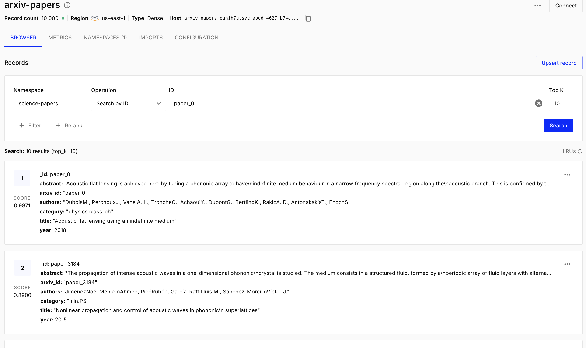

# Zazhytskyi_nosql_2

## Частина 1 — Підготовка даних і вибір інструментів

###  1.1. Завантаження і підготовка датасету

### 1.2. Вибір інструментів

1. Pinecone використовує Serverless-архітектуру як основний спосіб розгортання, на відміну від self-hosted і
вбудованої бібліотеки у випадку Qdrant і Chroma відповідно.
Pinecone є комерційним (proprietary, closed-source) продуктом, сервіс надається як DBaaS (Database as a Service),
самостійно розгорнути Pinecone на власному сервері не можна (виняток — спеціальна пропозиція BYOC для великих корпоративних клієнтів, де сервіс працює у вашому хмарному акаунті). Існують тарифні плани.
Продуктивність Pinecone аналогічна Qdrant і краща ніж в Chroma.
Pinecone обирати коли: хочете зосередитися на бізнес-логіці, а не на DevOps, потрібен швидкий MVP або proof-of-concept, команда невелика, немає виділеного інфраструктурного інженера.
Qdrant обирати коли: дані не можуть покидати вашу інфраструктуру (compliance, безпека), потрібен гібридний пошук з коробки, важлива продуктивність при складних фільтрах за метаданими.
Chroma обирати коли: потрібний швидкісий старт, прототипи, експерименти, локальні RAG-пайплайни.

2. Для задачі пошуку по науковим текстам обрана модель specter2_base тому що модель specter2_base
натренована на наукових текстах.
Model Description
SPECTER2 has been trained on over 6M triplets of scientific paper citations, which are available here. Post that it is trained with additionally attached task format specific adapter modules on all the SciRepEval training tasks.
Task Formats trained on:
Classification
Regression
Proximity (Retrieval)
Adhoc Search
It builds on the work done in SciRepEval: A Multi-Format Benchmark for Scientific Document Representations and we evaluate the trained model on this benchmark as well.

3. У Model Card для allenai/specter2_base не вказано явної рекомендації щодо метрики схожості.
Метрика схожості важлива при створенні індексу. Під час створення векторного індексу необхідно заздалегідь вибрати метрику відстані, оскільки саме вона визначає, як система буде шукати найближчі вектори.

### 1.3. Отримання ембеддингів

Тому що для нормалізованих векторів скалярний добуткок (dot product) чисельно дорівнює косинусній схожості.
Тобто при нормалізації довжина векторів стає одиничною, тому знаменник в формулі косинусної схожості стає
рівним 1, у результаті косинусна схожість і скалярний добуток мають одакове значення. 

## Частина 3 — Пошукові запити

Хоча у випадку обох прикладів А та В пошук був проведений за запитом "reinforcement learning", результати пошуку відрізняються, тому що пошук проводився з фільтрацією результатів. В першому випадку в рекзультат попали статті за останні 5 років і категорії cs.LG, а в другому випадку в рекзультат попали статті до 2015 року будь-якої категорії.

1. Результати топ-5 для cosine і dot product збігаються тому що для нормалізованих векторів скалярний добуткок чисельно дорівнює косинусній схожості.
2. Результати для L2 не відрізняються тому що вектори нормалізовані.
3. Якби ембеддинги не були нормалізовані тоді довжини векторів були б різні, довжина вектора впливала б на результат розрахунку dot product і L2-distance і результати були б незавжди еквівалентні.

## Частина 4 — Chunking

1. Розбивка тексту на чанки за стратегією Semantic chunking дає більш осмислені чанки, так як чанк містить цілі речення.
2. У випадку Fixed-size chunking є випадки розрізаних речень. Зміст чанку може бути неповним і спотвореним.
3. При зменшені overlap кількість чанків і покриття тексту зменшується, при збільшені overlap кількість чанків і покриття текту збільшується (тобто частини одного і того самого тексту і змісту знаходяться в різних чанках). 

## Частина 5 — Гібридний пошук

| Запит | BM25 | Векторний пошук | Гібридний пошук (RRF) | Висновок |
|-------|------|-----------------|-----------------------|----------|
| **BERT fine-tuning** | Найбільш релевантні статті про BERT, fine-tuning та модифікації переднавчання. Результати точно відповідають ключовим словам запиту. | Переважають сучасні роботи про LLM post-training, reinforcement fine-tuning та diffusion-моделі. Семантична схожість висока, але більшість результатів не стосується безпосередньо BERT. | Поєднує результати BM25 та векторного пошуку, однак у верхніх позиціях залишаються сучасні роботи про fine-tuning без прив'язки до BERT. | **BM25 показав найкращу точність**, гібридний — компромісний варіант, векторний — найбільш семантичний, але менш точний. |
| **Yann LeCun convolutional networks** | Знайдено статті про convolutional neural networks, однак ім'я Yann LeCun практично не вплинуло на результати. | Повертає роботи про сучасні CNN, ConvNeXt, CapsNet та інші архітектури, але без зв'язку з Yann LeCun. | Об'єднує результати обох методів, проте релевантність до автора залишається низькою. | **Жоден метод не знайшов робіт саме про Yann LeCun.** Причиною є відсутність відповідних документів у колекції. |
| **making computers understand human emotions from text** | Знайдено роботи про аналіз емоцій у соціальних мережах та емоційний аналіз тексту. Тематика відповідає запиту. | Семантично близькі роботи про sentiment analysis, emotion recognition, empathetic dialogue та multimodal emotion recognition. | Поєднує роботи про emotion analysis, sentiment analysis та соціальні мережі, забезпечуючи найбільш різноманітну видачу. | **Гібридний пошук показав найкращий баланс** між тематичною релевантністю та різноманітністю результатів. |

1. Метод гібридного пошуку з RRF дав кращий результат тому що гібридний пошук поєднує сильні сторони обох підходів, використовуючи алгоритм Reciprocal Rank Fusion (RRF) для об’єднання точності та семантичного розуміння
2. Є документи в топ-5 гібридного пошуку, яких немає в топ-5 окремих методів. Тому що сукупний скор дозволяє документу 
піднятися в рейтингу топ-5 гібридного пошуку, так як документ може бути присутній в обох рейтигах та займати непогані місця в кожному з них.
3. Зміна параметра k в RRF впливає на видачу (наприклад, k=60 vs k=1) таким чином, що при k=1 в топ рейтинг гібридного пошуку на перші місця попадають документи які займали перщі місця в обох рейтингах.

## Частина 6 — Аналіз і висновки
 1. 